# 1. 项目概述

## 1.1. 项目目标
- 建立完善的桥梁健康监测体系，实现桥梁结构安全的实时监控和预警
- 通过传感器数据采集和分析，提供桥梁结构健康状态的科学评估
- 实现数据可视化展示，为决策者提供直观的数据支持

## 1.2. 使用者角色
- 系统管理员：负责系统的配置管理、用户权限管理等系统维护工作
- 监测工程师：负责监测数据的分析、评估和预警处理，根据传感器数据进行桥梁健康状态评估
- 养护人员：执行日常巡检、维护任务，记录维护情况，上传检查报告
- 决策管理者：查看统计分析报告，进行决策支持
- 桥梁管理人员：管理桥梁基础信息，查看监测数据和报告，处理预警信息

# 2. 系统总体设计

## 2.1. 技术路线
本系统基于 B/S 架构进行精心设计，旨在为用户提供便捷高效的使用体验。

在开发语言方面，选用强大且成熟的 Java 语言来构建系统的核心逻辑，确保系统的稳定性和可扩展性。

操作系统选用Ubuntu 24.14，为系统的运行提供坚实的基础环境，保障系统的安全性和可靠性。

数据库采用基于PostgreSQL的Timescale DB，其具备出色的数据管理和存储能力，能够满足系统对大量传感器数据的处理和存储需求。

在系统框架方面，采用前后端分离的架构模式，使前端和后端的开发能够更加独立和高效。其中，后端框架选择了功能强大且易于开发和维护的 Spring Boot，它能够快速搭建高效稳定的后端服务；前端框架则选用了用户体验优秀、交互性强的 Vue，为用户提供流畅、美观的操作界面。

传感器数据采集方面，选用Go语言，为高频数据的接收和特征计算提供高性能和稳定性。

## 2.2. 系统架构

### 2.2.1. 系统架构设计

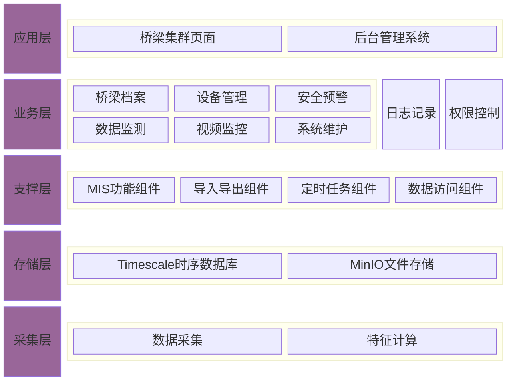
```mermaid
block-beta
columns 8
  A["应用层"]:1
  block:_应用层:7
    桥梁集群页面 后台管理系统
  end
  B["业务层"]:1
  block:_业务层:5
    columns 3
    桥梁档案
    设备管理
    安全预警
    数据监测
    视频监控
    系统维护
  end
  日志记录 权限控制
  C["支撑层"]:1
  block:_支撑层:7
    MIS功能组件 导入导出组件 定时任务组件 数据访问组件
  end
  D["存储层"]:1
  block:_存储层:7
    Timescale时序数据库 MinIO文件存储
  end
  E["采集层"]:1
  block:_采集层:7
    数据采集 特征计算
  end
  classDef layer fill:#969,color:white
  class A,B,C,D,E layer
```

平台涉及的各层结构及功能说明如下：

本系统在系统架构上分为 5 个层次，分别为应用层、业务应用层、业务支撑层、数据存储层和数据采集层。

**系统应用层**：
本系统面向两类用户群体提供服务:
- 桥梁集群页面：面向监测工程师和养护人员,提供桥梁监测数据展示、预警信息处理等功能
- 后台管理系统：面向系统管理员和决策管理者,提供系统配置、数据分析等功能

**系统业务层**：
本系统提供的核心业务功能包括：
- 桥梁管理：桥梁基础信息的录入、查询和维护
- 设备管理：传感器和监控设备的配置和状态监控
- 安全预警：预警规则配置、预警信息处理
- 数据监测：实时数据采集、特征计算、历史数据查询
- 视频监控：实时视频查看、视频回放
- 系统维护：用户权限管理、系统配置管理、日志管理

**系统支撑层**：
为实现业务层功能提供基础支撑：
- MIS功能组件：提供基础的增删改查功能
- 导入导出组件：支持数据的批量导入导出
- 定时任务组件：执行数据采集、预警检测等定时任务
- 数据访问组件：统一的数据库访问接口

**数据存储层**：
采用多种数据库技术满足不同数据存储需求：
- Timescale时序数据库：存储传感器采集的监测数据,支持高效的时序数据查询和分析
- MinIO文件存储：存储桥梁图片、检查报告、视频监控等非结构化数据
- Redis缓存：存储频繁访问的数据,提升系统响应速度

**数据采集层**：
负责系统数据的采集和预处理：
- 数据采集：通过传感器采集桥梁结构健康监测数据,包括应变、位移、加速度等物理量
- 特征计算：对采集的原始数据进行特征值计算,为桥梁健康状态评估提供数据支持

### 2.2.2. 技术框架设计
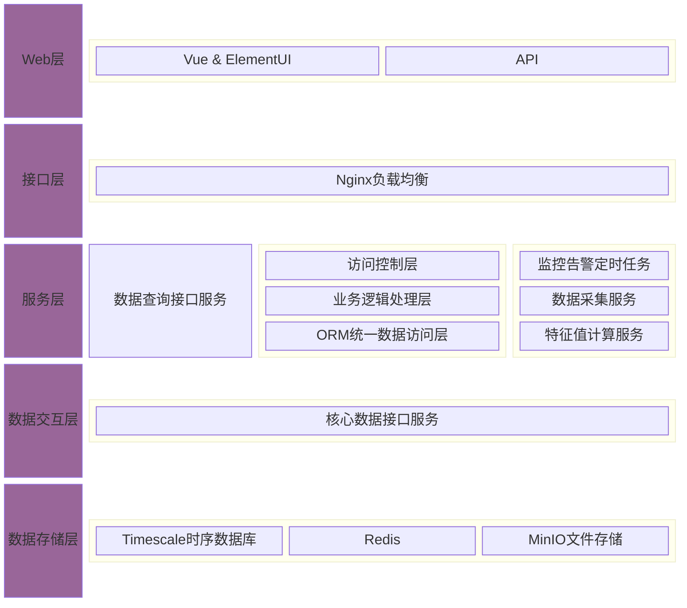
```mermaid
block-beta
  columns 8
    A["Web层"]:1
    block:_Web层:7
      Vue&nbsp;&&nbsp;ElementUI API
    end
    B["接口层"]:1
    block:_接口层:7
      Nginx负载均衡
    end
    D["服务层"]:1
      数据查询接口服务:2
      block:_业务服务:3
        columns 1
        访问控制层 业务逻辑处理层 ORM统一数据访问层
      end
      block:_数据处理服务:2
        columns 1
        监控告警定时任务
        数据采集服务
        特征值计算服务
      end
    E["数据交互层"]:1
    block:_数据交互层:7
      核心数据接口服务
    end
    F["数据存储层"]:1
    block:_数据存储层:7
      Timescale时序数据库 Redis MinIO文件存储
    end
  classDef layer fill:#969,color:white
  class A,B,C,D,E,F layer
```

本系统的技术架构分为以下六个层次：

1. **Web层**：
- 采用Vue + ElementUI构建前端界面
- 提供RESTful API接口供外部系统访问
- 实现用户交互和数据展示功能

2. **接口层**：
- 使用Nginx实现反向代理和负载均衡
- 处理所有来自Web层的请求
- 确保系统接口的高可用性和稳定性

3. **服务层**：
包含三个主要服务模块：
- 数据查询接口服务：提供统一的数据查询接口
- 业务服务：
  * 访问控制层：实现用户认证和权限控制
  * 业务逻辑处理层：处理核心业务逻辑
  * ORM统一数据访问层：规范化数据库操作
- 数据处理服务：
  * 监控告警定时任务：执行预警检测
  * 数据采集服务：处理传感器数据采集
  * 特征值计算服务：进行数据分析计算

4. **数据交互层**：
- 提供核心数据接口服务
- 统一管理系统与数据库之间的交互
- 实现数据访问的标准化和规范化

5. **数据存储层**：
采用多种存储方案：
- Timescale时序数据库：存储传感器监测数据
- Redis：提供高速缓存服务
- MinIO：存储文件类非结构化数据

这样的分层设计确保了系统各个组件之间的解耦,同时提供了清晰的职责划分和良好的可扩展性。

## 2.3. 系统功能

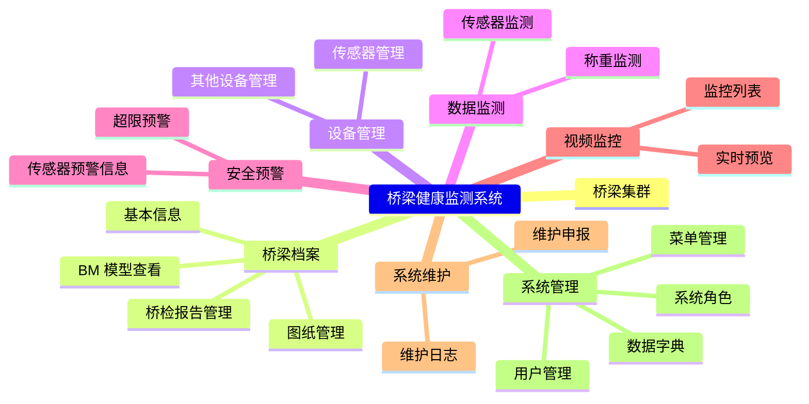
```mermaid
mindmap
  桥梁健康监测系统
    桥梁集群
    桥梁档案
        基本信息
        BM 模型查看
        图纸管理
        桥检报告管理
    设备管理
        传感器管理
        其他设备管理
    数据监测
        传感器监测
        称重监测
    安全预警
        传感器预警信息
        超限预警
    视频监控
        监控列表
        实时预览
    系统维护
        维护申报
        维护日志
    系统管理
        菜单管理
        用户管理
        系统角色
        数据字典
```

## 2.4. 系统数据流程

### 2.4.1. 与外部系统数据流图
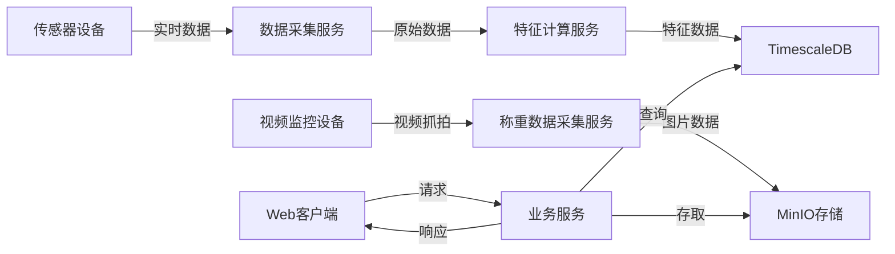
```mermaid
graph LR
    A[传感器设备] -->|实时数据| B[数据采集服务]
    B -->|原始数据| C[特征计算服务]
    C -->|特征数据| D[TimescaleDB]
    E[视频监控设备] -->|视频抓拍| F[称重数据采集服务]
    F -->|图片数据| G[MinIO存储]
    H[Web客户端] -->|请求| I[业务服务]
    I -->|响应| H
    I -->|查询| D
    I -->|存取| G
```

### 2.4.2. 内部数据流图
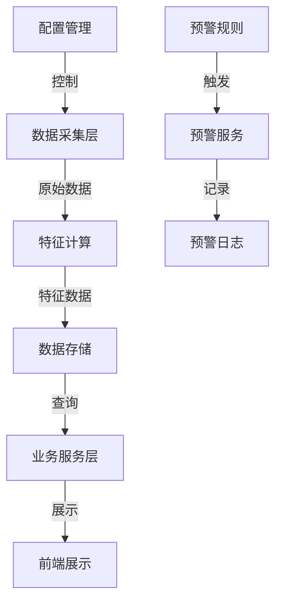
```mermaid
graph TD
    A[数据采集层] -->|原始数据| B[特征计算]
    B -->|特征数据| C[数据存储]
    C -->|查询| D[业务服务层]
    D -->|展示| E[前端展示]
    F[配置管理] -->|控制| A
    G[预警规则] -->|触发| H[预警服务]
    H -->|记录| I[预警日志]
```

## 2.5. 存储设计

### 2.5.1. 文件存储设计
- 采用MinIO分布式对象存储系统
- 主要存储内容:
  - 桥梁图片资料
  - 检查报告文件
  - 视频监控数据
  - 系统日志文件

### 2.5.2. 数据存储设计
- 基础数据库: PostgreSQL
  - 存储桥梁基本信息
  - 设备管理信息
  - 系统配置信息
  - 用户权限信息

- 时序数据库: TimescaleDB（PostgreSQL插件）
  - 存储传感器采集数据
  - 数据特征值
  - 预警记录
  - 设备状态数据

- 缓存数据库: Redis
  - 缓存频繁访问数据
  - 存储会话信息
  - 临时数据存储

## 2.6. 部署设计

### 2.6.1. 逻辑部署设计
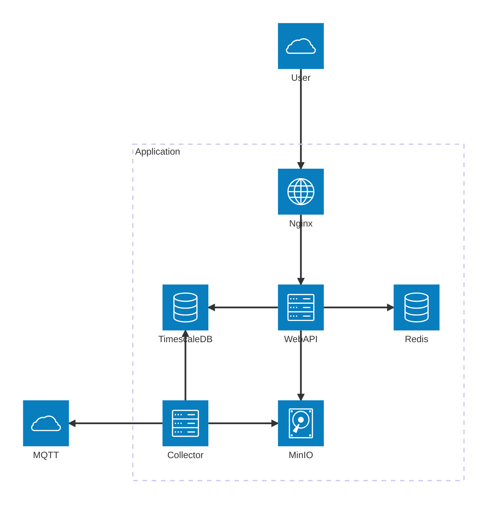
```mermaid
architecture-beta
    group api[Application]

    service db(database)[TimescaleDB] in api
    service etl(server)[Collector] in api
    service file(disk)[MinIO] in api
    service server(server)[WebAPI] in api
    service redis(database)[Redis] in api
    service nginx(internet)[Nginx] in api

    service outside(cloud)[MQTT]
    service userC(cloud)[User]

    userC:B --> T:nginx
    nginx:B --> T:server
    server:L --> R:db
    server:B --> T:file
    server:R --> L:redis
    etl:T --> B:db
    etl:L --> R:outside
    etl:R --> L:file
```

系统的逻辑部署架构说明如下：

1. **应用服务组件**：
   - WebAPI服务：处理所有业务请求的核心服务
   - Collector服务：负责数据采集和特征计算的服务
   - Nginx：提供反向代理和负载均衡

2. **数据存储组件**：
   - TimescaleDB：存储传感器数据和业务数据
   - Redis：提供缓存服务
   - MinIO：存储文件类数据

3. **外部交互组件**：
   - MQTT服务：与传感器设备进行数据通信
   - 用户访问：通过Nginx进行请求转发

4. **数据流向**：
   - 用户请求通过Nginx转发到WebAPI服务
   - WebAPI服务与各种存储服务交互获取数据
   - Collector服务从MQTT接收数据并存储到TimescaleDB和MinIO

### 2.6.2. 物理部署设计

#### 2.6.2.1. 软件需求
- **操作系统**
  - 服务器：Ubuntu Server 24.14 LTS
  - 客户端：支持主流浏览器(Chrome、Firefox、Edge等)

- **应用服务器**
  - WebAPI服务：JDK 8、Spring Boot 2.x
  - Collector服务：Go 1.21
  - Nginx：1.24或更高版本

- **数据库服务**
  - TimescaleDB：基于PostgreSQL 14
  - Redis：7.x
  - MinIO：最新稳定版

#### 2.6.2.2. 硬件需求

1. **业务服务器**
   - CPU: 4核
   - 内存: 16GB
   - 存储空间: 200GB
   - 用途: 部署WebAPI服务和Nginx

2. **采集服务器**
   - CPU: 4核
   - 内存: 16GB
   - 存储空间: 500GB
   - 用途: 部署数据采集服务和特征计算服务

3. **业务数据库服务器**
   - CPU: 4核
   - 内存: 16GB
   - 存储空间: 200GB
   - 用途: 部署TimescaleDB和Redis

4. **文件服务器**
   - CPU: 4核
   - 内存: 16GB
   - 存储空间: 1TB
   - 用途: 部署MinIO对象存储服务

5. **其他要求**
   - UPS供电保护
   - 机房恒温恒湿
   - 防火墙保护

# 3. 业务场景分析

## 3.1. 超限预警管理流程

### 3.1.1. 涉及用户
- 系统管理员：配置预警规则
- 监控人员：处理预警信息
- 维护人员：执行预警处置
- 管理人员：查看预警统计

### 3.1.2. 流程图
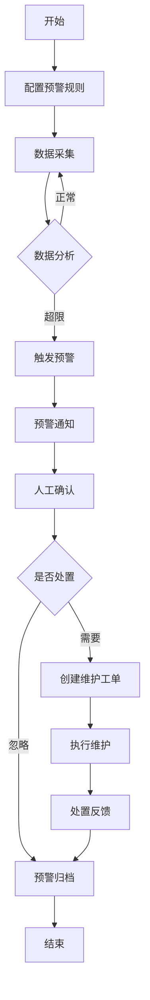
```mermaid
graph TD
    A[开始] --> B[配置预警规则]
    B --> C[数据采集]
    C --> D{数据分析}
    D -->|超限| E[触发预警]
    D -->|正常| C
    E --> F[预警通知]
    F --> G[人工确认]
    G --> H{是否处置}
    H -->|需要| I[创建维护工单]
    H -->|忽略| J[预警归档]
    I --> K[执行维护]
    K --> L[处置反馈]
    L --> J
    J --> M[结束]
```

## 3.2. 传感器监测流程

### 3.2.1. 涉及用户
- 监测设备：采集数据
- 系统服务：处理数据
- 监控人员：查看数据
- 管理人员：分析数据

### 3.2.2. 流程图
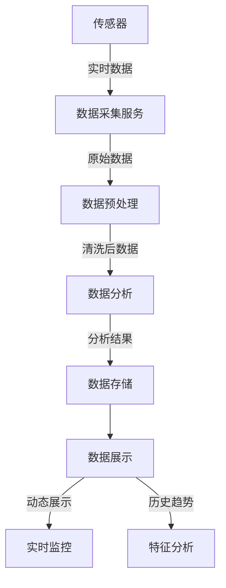
```mermaid
graph TD
    A[传感器] -->|实时数据| B[数据采集服务]
    B -->|原始数据| C[数据预处理]
    C -->|清洗后数据| D[数据分析]
    D -->|分析结果| E[数据存储]
    E --> F[数据展示]
    F -->|动态展示| G[实时监控]
    F -->|历史趋势| H[特征分析]
```

## 3.3. 桥梁档案管理流程

### 3.3.1. 涉及用户
- 桥梁管理员：负责桥梁基本信息、图纸和检查报告的管理
- 系统管理员：负责用户权限管理和系统配置
- 普通用户：查看桥梁档案信息

### 3.3.2. 流程图
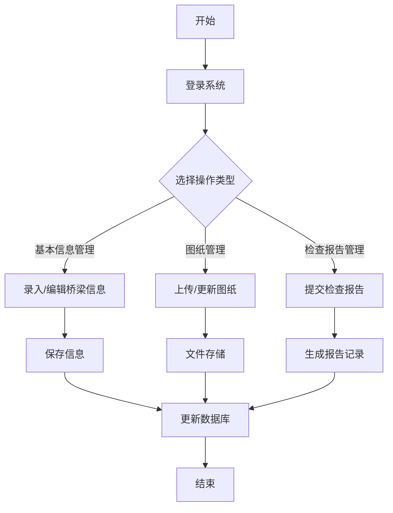
```mermaid
graph TD
    A[开始] --> B[登录系统]
    B --> C{选择操作类型}
    C -->|基本信息管理| D[录入/编辑桥梁信息]
    C -->|图纸管理| E[上传/更新图纸]
    C -->|检查报告管理| F[提交检查报告]
    D --> G[保存信息]
    E --> H[文件存储]
    F --> I[生成报告记录]
    G --> J[更新数据库]
    H --> J
    I --> J
    J --> K[结束]
```

## 3.4. 维护报告管理流程

### 3.4.1. 涉及用户
- 维护人员：负责执行维护工作并提交报告
- 审核人员：负责审核维护报告
- 管理人员：查看和管理维护记录
- 系统管理员：维护报告模板和系统配置

### 3.4.2. 流程图
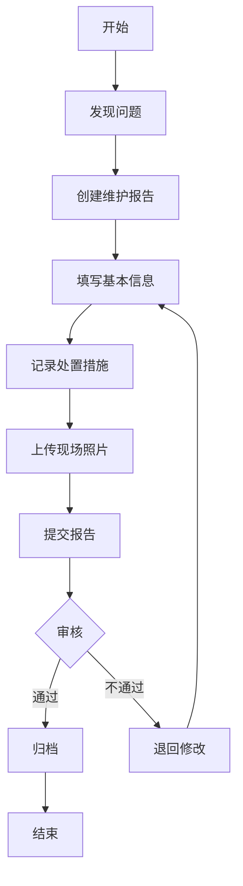
```mermaid
graph TD
    A[开始] --> B[发现问题]
    B --> C[创建维护报告]
    C --> D[填写基本信息]
    D --> E[记录处置措施]
    E --> F[上传现场照片]
    F --> G[提交报告]
    G --> H{审核}
    H -->|通过| I[归档]
    H -->|不通过| J[退回修改]
    J --> D
    I --> K[结束]
```

# 4. 子系统设计

## 4.1. 桥梁集群模块

### 4.1.1. 用例图
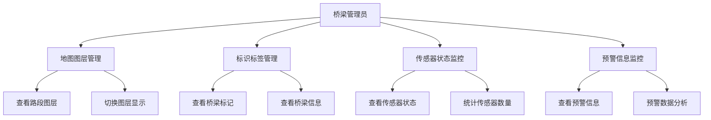
```mermaid
graph TD
    A[桥梁管理员] --> B[地图图层管理]
    A --> C[标识标签管理]
    A --> D[传感器状态监控]
    A --> E[预警信息监控]
    B --> F[查看路段图层]
    B --> G[切换图层显示]
    C --> H[查看桥梁标记]
    C --> I[查看桥梁信息]
    D --> J[查看传感器状态]
    D --> K[统计传感器数量]
    E --> L[查看预警信息]
    E --> M[预警数据分析]
```

### 4.1.2. 功能描述

1. **地图图层管理**
- 功能编号：A001
- 功能分类：桥梁集群
- 功能名称：地图图层管理
- 用户角色：桥梁管理员、监测工程师
- 功能说明：
  > 在电子地图上加载和管理东、西、南环的路段图层,实现桥梁与所在路段的地理位置关系展示。支持地图的缩放和平移操作。
- 前置条件：用户已登录系统,且具有地图查看权限
- 后置条件：系统展示相应的地图图层
- 业务规则：地图数据需准确,拖拽时展示流畅

1. **标识标签管理**
- 功能编号：A002
- 功能分类：桥梁集群
- 功能名称：标识标签管理
- 用户角色：桥梁管理员、监测工程师
- 功能说明：
  > 在电子地图上展示桥梁位置标记,点击标记可查看桥梁基本信息、传感器统计、预警信息等详细内容。支持标记的聚合展示和信息窗口的自定义配置。
- 前置条件：用户已登录系统,地图图层已加载
- 后置条件：系统展示桥梁标记和详细信息
- 业务规则：标记位置准确,信息展示完整

1. **传感器状态监控**
- 功能编号：A003
- 功能分类：桥梁集群
- 功能名称：传感器状态监控
- 用户角色：桥梁管理员、监测工程师
- 功能说明：
  > 实时统计并展示在线传感器、离线传感器和预警传感器的数量
- 前置条件：传感器数据采集正常
- 后置条件：系统展示传感器状态统计
- 业务规则：状态更新及时,统计准确

1. **预警信息监控**
- 功能编号：A004
- 功能分类：桥梁集群
- 功能名称：预警信息监控
- 用户角色：桥梁管理员、监测工程师
- 功能说明：
  > 统计并展示各级别预警数量,展示预警详细信息和趋势分析。支持预警信息的实时推送和历史查询,支持预警数据的图表展示。
- 前置条件：预警规则已配置
- 后置条件：系统展示预警统计和分析结果
- 业务规则：预警分级准确

### 4.1.3. 流程描述
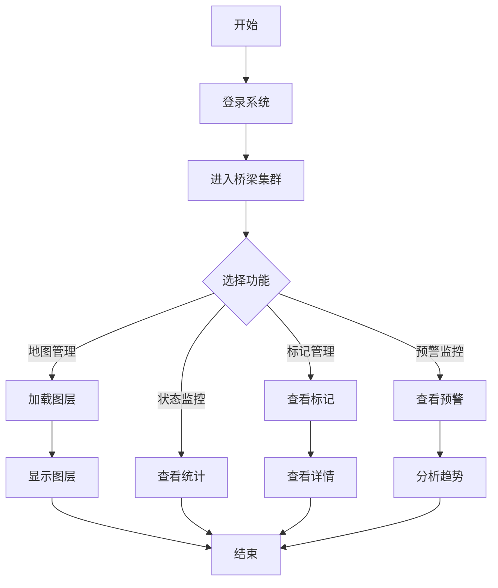
```mermaid
graph TD
    A[开始] --> B[登录系统]
    B --> C[进入桥梁集群]
    C --> D{选择功能}
    D -->|地图管理| E[加载图层]
    D -->|标记管理| F[查看标记]
    D -->|状态监控| G[查看统计]
    D -->|预警监控| H[查看预警]
    E --> I[显示图层]
    F --> J[查看详情]
    H --> L[分析趋势]
    I --> M[结束]
    G --> M
    J --> M
    L --> M
```

### 4.1.4. 输入输出

| 名称     | I/O | 内容                           |
| -------- | --- | ------------------------------ |
| 地图操作 | I   | 地图缩放、平移等操作           |
| 标记查看 | I   | 点击标记查看详情               |
| 状态查询 | I   | 传感器状态统计查询             |
| 预警查询 | I   | 预警信息查询条件               |
| 地图展示 | O   | 地图图层、桥梁标记展示         |
| 详情展示 | O   | 桥梁信息、传感器统计、预警信息 |
| 预警分析 | O   | 预警统计数据、趋势分析图表     |

### 4.1.5. 业务数据描述

| 序号 | 业务对象   | 涉及数据属性                               |
| ---- | ---------- | ------------------------------------------ |
| 1    | 桥梁信息   | 桥梁ID、名称、位置坐标、基本信息、图片资料 |
| 2    | 传感器状态 | 传感器状态、统计数量                       |
| 3    | 预警信息   | 预警ID、级别、时间、内容、处理状态         |

### 4.1.6. ER图
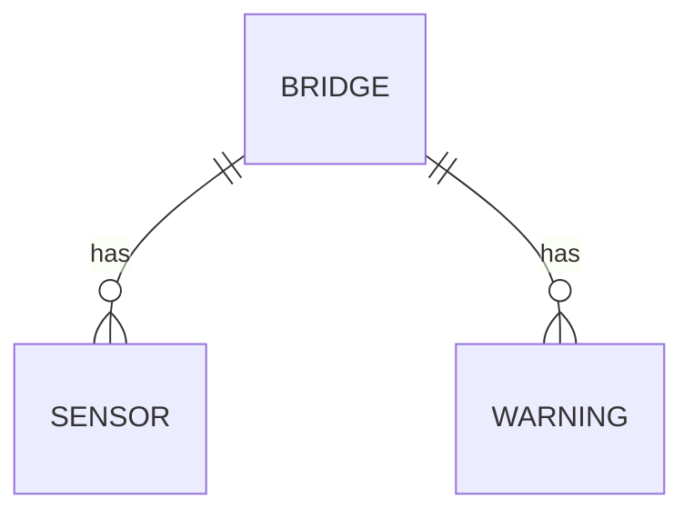
```mermaid
erDiagram
    BRIDGE ||--o{ SENSOR : has
    BRIDGE ||--o{ WARNING : has
```

## 4.2. 桥梁档案模块

### 4.2.1. 用例图
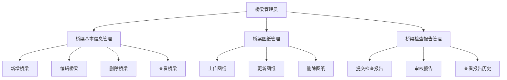
```mermaid
graph TD
    A[桥梁管理员] --> B[桥梁基本信息管理]
    A --> C[桥梁图纸管理]
    A --> D[桥梁检查报告管理]
    B --> E[新增桥梁]
    B --> F[编辑桥梁]
    B --> G[删除桥梁]
    B --> H[查看桥梁]
    C --> I[上传图纸]
    C --> J[更新图纸]
    C --> K[删除图纸]
    D --> L[提交检查报告]
    D --> M[审核报告]
    D --> N[查看报告历史]
```

### 4.2.2. 桥梁档案管理

#### 4.2.2.1. 功能描述

1. **桥梁基本信息管理**
- 功能编号：B001
- 功能分类：桥梁基础管理
- 功能名称：桥梁基本信息管理
- 用户角色：桥梁管理员、系统管理员
- 功能说明：
  > 对桥梁的基本信息进行管理，包括新增、修改、删除和查询桥梁信息。支持录入桥梁的基础信息、结构参数、建设信息等内容，并可上传桥梁相关图片和设计图纸。
- 前置条件：用户需具备桥梁管理权限，并完成系统登录
- 后置条件：桥梁信息更新后在系统中生效，相关记录得到更新
- 业务规则：桥梁编码不可重复，必填字段需完整填写


2. **桥梁图纸管理**
- 功能编号：B002
- 功能分类：桥梁基础管理
- 功能名称：桥梁图纸管理
- 用户角色：桥梁管理员
- 功能说明：
  > 管理桥梁相关的设计图纸、施工图纸等文档资料。支持图纸的上传、更新、删除和查看，并可对图纸进行分类管理和版本控制。
- 前置条件：桥梁基本信息已创建，用户具备图纸管理权限
- 后置条件：图纸信息更新后可在系统中查看和下载
- 业务规则：支持的文件格式包括CAD、PDF等常用格式


3. **桥梁检查报告管理**
- 功能编号：B003
- 功能分类：桥梁基础管理
- 功能名称：桥梁检查报告管理
- 用户角色：桥梁检查员、桥梁管理员
- 功能说明：
  > 管理桥梁定期检查、专项检查等各类检查报告。支持报告的提交、审核、查询和统计分析功能。
- 前置条件：桥梁基本信息已创建，检查工作已完成
- 后置条件：检查报告提交后进入审核流程
- 业务规则：检查报告需按规定格式填写，并附必要的现场照片

#### 4.2.2.2. 流程描述
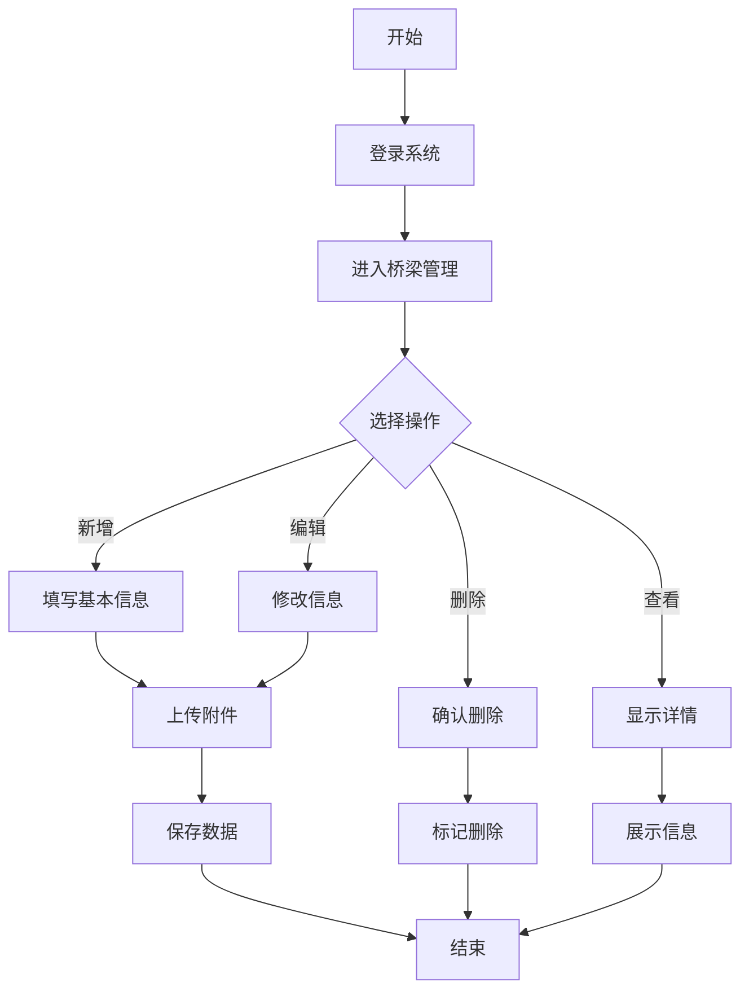
```mermaid
graph TD
    A[开始] --> B[登录系统]
    B --> C[进入桥梁管理]
    C --> D{选择操作}
    D -->|新增| E[填写基本信息]
    D -->|编辑| F[修改信息]
    D -->|删除| G[确认删除]
    D -->|查看| H[显示详情]
    E --> I[上传附件]
    F --> I
    I --> J[保存数据]
    G --> K[标记删除]
    H --> L[展示信息]
    J --> M[结束]
    K --> M
    L --> M
```

#### 4.2.2.3. 输入输出

1. **桥梁基本信息管理**

| 名称         | I/O | 内容                                             |
| ------------ | --- | ------------------------------------------------ |
| 基础信息     | I   | 桥梁编码、名称、简称、所在路线、中心桩号         |
| 结构参数     | I   | 桥梁全长、跨径总长、桥梁全宽、净宽、结构类型     |
| 建设信息     | I   | 建设单位、设计单位、施工单位、监理单位、修建年度 |
| 管理信息     | I   | 管养单位、监管部门、技术状况等级、评定日期       |
| 附件资料     | I   | 桥梁照片、logo图片、设计图纸                     |
| 基本信息列表 | O   | 桥梁信息列表(分页)、查询结果列表                 |
| 详细信息     | O   | 桥梁基本信息卡片、图片及图纸预览                 |

1. **桥梁图纸管理**

| 名称     | I/O | 内容                         |
| -------- | --- | ---------------------------- |
| 图纸信息 | I   | 图纸名称、图纸类型、说明备注 |
| 文件信息 | I   | 图纸文件、上传时间、版本说明 |
| 图纸列表 | O   | 图纸信息列表、文件预览       |
| 操作结果 | O   | 上传结果、更新结果、删除结果 |

3. **桥梁检查报告管理**

| 名称     | I/O | 内容                         |
| -------- | --- | ---------------------------- |
| 报告信息 | I   | 报告名称、检查年度、检查类型 |
| 检查内容 | I   | 检查结果、评定等级、处置建议 |
| 附件资料 | I   | 现场照片、检测数据、补充说明 |
| 报告列表 | O   | 检查报告列表、文件预览       |
| 操作结果 | O   | 上传结果、更新结果、删除结果 |

#### 4.2.2.4. 页面交互
- 列表页:展示桥梁基本信息,支持分页、排序和条件查询
- 新增/编辑页:表单形式,分组展示各类信息项
- 详情页:完整展示桥梁所有信息,包括图片预览
- 地图页:展示桥梁位置,支持地图定位和查看

#### 4.2.2.5. 业务数据描述
定义了桥梁健康监测系统相关业务数据的结构。

| 序号 | 业务对象     | 涉及数据属性                                                                                                                                                                         |
| ---- | ------------ | ------------------------------------------------------------------------------------------------------------------------------------------------------------------------------------ |
| 1    | 桥梁基本信息 | 桥梁ID、桥梁编码、桥梁名称、简称、中心桩号、所在路线、全长、跨径总长、全宽、净宽、桥梁全宽、单孔最大跨径、经纬度坐标、桥梁名片、照片、logo图片、平面图、备注信息、创建时间、更新时间 |
| 2    | 桥梁检查报告 | 报告ID、桥梁ID、报告名称、检查年度、总体技术状况、评分、检测单位、说明、附件文件、创建人、更新人、创建时间、更新时间                                                                 |
| 3    | 桥梁图纸信息 | 图纸ID、桥梁ID、图纸名称、图纸类型、说明备注、文件、设计单位、上传时间、版本说明、创建人、更新人、创建时间、更新时间                                                                 |

#### 4.2.2.6. ER 图
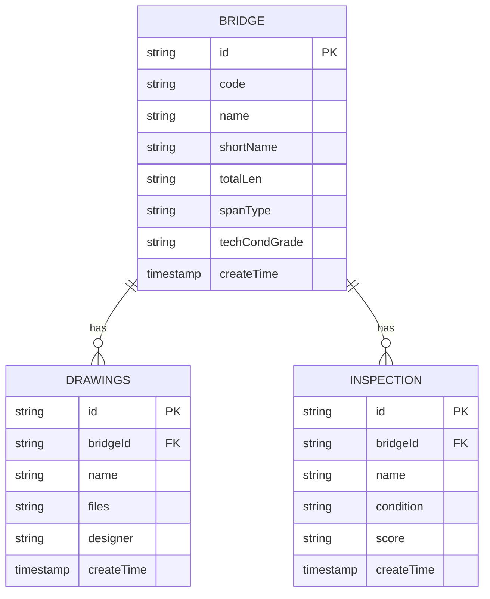
```mermaid
erDiagram
    BRIDGE ||--o{ DRAWINGS : has
    BRIDGE ||--o{ INSPECTION : has
    BRIDGE {
        string id PK
        string code
        string name
        string shortName
        string totalLen
        string spanType
        string techCondGrade
        timestamp createTime
    }
    DRAWINGS {
        string id PK
        string bridgeId FK
        string name
        string files
        string designer
        timestamp createTime
    }
    INSPECTION {
        string id PK
        string bridgeId FK
        string name
        string condition
        string score
        timestamp createTime
    }
```

## 4.3. 设备管理模块
### 4.3.1. 用例图
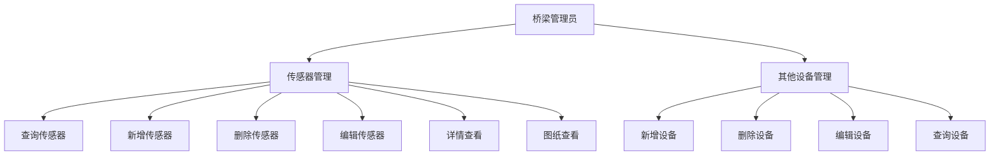
```mermaid
graph TD
    A[桥梁管理员] --> B[传感器管理]
    A --> C[其他设备管理]
    B --> D[查询传感器]
    B --> E[新增传感器]
    B --> F[删除传感器]
    B --> G[编辑传感器]
    B --> H[详情查看]
    B --> I[图纸查看]
    C --> J[新增设备]
    C --> K[删除设备]
    C --> L[编辑设备]
    C --> M[查询设备]
```

### 4.3.2. 传感器管理
#### 4.3.2.1. 功能描述
1. **查询传感器**
- 功能编号：D001
- 功能分类：设备管理
- 功能名称：查询传感器
- 用户角色：桥梁管理员、监测工程师
- 功能说明：
  > 可按监测类别、传感器类型、传感器编号、所在位置、左右幅、状态查询传感器信息，以表格形式展示查询结果，支持查询结果数据的导出。
- 前置条件：用户已登录系统，且具有相应的查询权限。
- 后置条件：系统根据查询条件返回相应的传感器信息列表。
- 业务规则：查询条件需符合系统设定的格式和范围。
- 补充说明：无

2. **新增传感器**
- 功能编号：D002
- 功能分类：设备管理
- 功能名称：新增传感器
- 用户角色：桥梁管理员、监测工程师
- 功能说明：
  > 当前端传感器子系统新增传感器设备时，可在系统同步新增加传感器信息，支持数据批量导入。
- 前置条件：用户已登录系统，且具有新增权限，前端传感器子系统已添加传感器设备。
- 后置条件：系统中新增传感器信息，并与前端传感器子系统数据同步。
- 业务规则：新增传感器信息需符合数据格式要求，批量导入的数据需满足模板规范。
- 补充说明：无

3. **删除传感器**
- 功能编号：D003
- 功能分类：设备管理
- 功能名称：删除传感器
- 用户角色：桥梁管理员、监测工程师
- 功能说明：
  > 支持批量删除传感器。
- 前置条件：用户已登录系统，且具有删除权限，所选传感器未被其他功能模块占用。
- 后置条件：系统中删除相应传感器信息，相关数据关联关系更新。
- 业务规则：删除操作需谨慎，需进行二次确认。
- 补充说明：无

4. **编辑传感器**
- 功能编号：D004
- 功能分类：设备管理
- 功能名称：编辑传感器
- 用户角色：桥梁管理员、监测工程师
- 功能说明：
  > 对传感器设备信息进行编辑。
- 前置条件：用户已登录系统，且具有编辑权限，传感器信息存在且可编辑。
- 后置条件：系统中传感器信息更新，相关数据关联关系更新。
- 业务规则：编辑后的信息需符合数据格式要求。
- 补充说明：无

5. **详情查看**
- 功能编号：D005
- 功能分类：设备管理
- 功能名称：详情查看
- 用户角色：桥梁管理员、监测工程师
- 功能说明：
  > 查看传感器的详细信息，包括传感器编号、传感器类型、监测内容、监测类别、监测类别编号、所在位置、左右幅、所在构件、生产商、型号、数据采样频率、展示时长配置、数据传输组、数据采集组、安装时间等。
- 前置条件：用户已登录系统，且具有查看权限，传感器信息存在。
- 后置条件：系统展示传感器详细信息。
- 业务规则：无
- 补充说明：无

6. **图纸查看**
- 功能编号：D006
- 功能分类：设备管理
- 功能名称：图纸查看
- 用户角色：桥梁管理员、监测工程师
- 功能说明：
  > 在线预览传感器工程图纸。
- 前置条件：用户已登录系统，且具有查看权限，传感器工程图纸已上传。
- 后置条件：系统展示传感器工程图纸。
- 业务规则：无
- 补充说明：无

#### 4.3.2.2. 流程描述
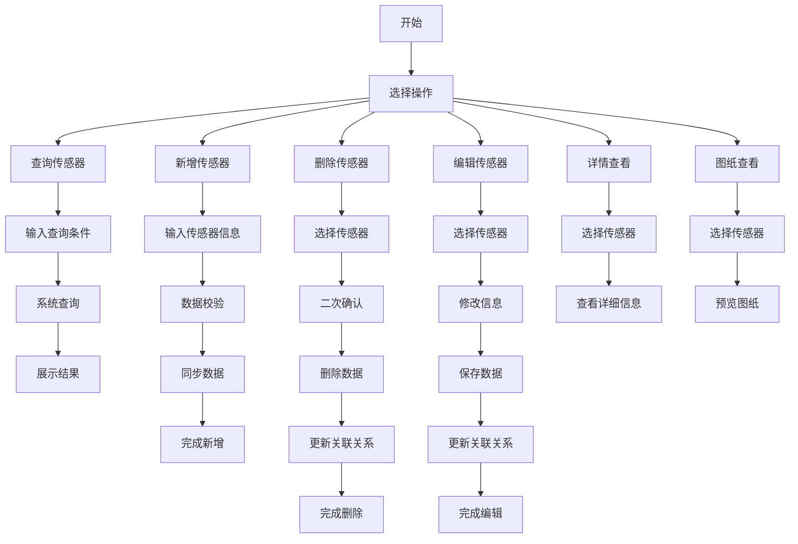
```mermaid
graph TD
    A[开始] --> B[选择操作]
    B --> C[查询传感器]
    B --> D[新增传感器]
    B --> E[删除传感器]
    B --> F[编辑传感器]
    B --> G[详情查看]
    B --> H[图纸查看]
    C --> I[输入查询条件]
    I --> J[系统查询]
    J --> K[展示结果]
    D --> L[输入传感器信息]
    L --> M[数据校验]
    M --> N[同步数据]
    N --> O[完成新增]
    E --> P[选择传感器]
    P --> Q[二次确认]
    Q --> R[删除数据]
    R --> S[更新关联关系]
    S --> T[完成删除]
    F --> U[选择传感器]
    U --> V[修改信息]
    V --> W[保存数据]
    W --> X[更新关联关系]
    X --> Y[完成编辑]
    G --> Z[选择传感器]
    Z --> AA[查看详细信息]
    H --> BB[选择传感器]
    BB --> CC[预览图纸]
```

#### 4.3.2.3. 输入输出

| 名称     | I/O | 内容                                                                                                           |
| -------- | --- | -------------------------------------------------------------------------------------------------------------- |
| 输入参数 | I   | 监测类别、传感器类型、传感器编号、所在位置、左右幅、状态等查询条件；新增传感器的各项信息；编辑传感器的修改信息 |
| 输出参数 | O   | 查询结果列表、新增或编辑结果提示、传感器详细信息、图纸预览                                                     |

#### 4.3.2.4. 页面交互
- **查询传感器**：在查询页面，用户输入查询条件，点击查询按钮，系统展示查询结果列表后可进行数据导出操作。
- **新增传感器**：在新增页面，用户填写传感器信息，点击保存按钮，系统进行数据校验，成功后同步数据并提示新增成功。
- **删除传感器**：在列表页面，用户选择要删除的传感器，点击删除按钮，系统进行二次确认，确认后删除数据并更新关联关系。
- **编辑传感器**：在列表页面，用户选择要编辑的传感器，进入编辑页面修改信息，点击保存按钮，系统保存数据并更新关联关系。
- **详情查看**：在列表页面，用户点击传感器详情按钮，系统展示传感器详细信息。
- **图纸查看**：在详情页面或列表页面，用户点击图纸查看按钮，系统弹出图纸预览窗口。

#### 4.3.2.5. 业务数据描述

| 序号 | 业务对象 | 涉及数据属性                                                                                                                                                                       |
| ---- | -------- | ---------------------------------------------------------------------------------------------------------------------------------------------------------------------------------- |
| 1    | 传感器   | 传感器编号、传感器类型、监测内容、监测类别、监测类别编号、所在位置、左右幅、所在构件、生产商、型号、数据采样频率、展示时长配置、数据传输组、数据采集组、安装时间、状态、图纸文件等 |

#### 4.3.2.6. ER图
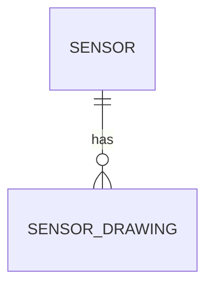
```mermaid
erDiagram
    SENSOR ||--o{ SENSOR_DRAWING : has
```

### 4.3.3. 其他设备管理
#### 4.3.3.1. 功能描述
1. **新增设备**
- 功能编号：D007
- 功能分类：设备管理
- 功能名称：新增设备
- 用户角色：桥梁管理员、监测工程师
- 功能说明：
  > 对前端监测子系统除传感器设备外的其他设备（如工控机、交换机等）信息进行统一管理维护，可新增设备信息，包括设备编号、设备类型、设备名称、所在位置、左右幅、生产商、型号、安装日期、设备照片、当前状态等。
- 前置条件：用户已登录系统，且具有新增权限。
- 后置条件：系统中新增设备信息。
- 业务规则：新增设备信息需符合数据格式要求，设备编号需唯一。
- 补充说明：无

2. **删除设备**
- 功能编号：D008
- 功能分类：设备管理
- 功能名称：删除设备
- 用户角色：桥梁管理员、监测工程师
- 功能说明：
  > 可根据业务情况删除其他设备信息。
- 前置条件：用户已登录系统，且具有删除权限，所选设备未被其他功能模块占用。
- 后置条件：系统中删除相应设备信息，相关数据关联关系更新。
- 业务规则：删除操作需谨慎，需进行二次确认。
- 补充说明：无

3. **编辑设备**
- 功能编号：D009
- 功能分类：设备管理
- 功能名称：编辑设备
- 用户角色：桥梁管理员、监测工程师
- 功能说明：
  > 对其他设备信息进行编辑。
- 前置条件：用户已登录系统，且具有编辑权限，设备信息存在且可编辑。
- 后置条件：系统中设备信息更新，相关数据关联关系更新。
- 业务规则：编辑后的信息需符合数据格式要求。
- 补充说明：无

4. **查询设备**
- 功能编号：D010
- 功能分类：设备管理
- 功能名称：查询设备
- 用户角色：桥梁管理员、监测工程师
- 功能说明：
  > 可根据设备编号、设备类型、所在位置、左右幅、状态等条件查询其他设备信息，以表格形式展示查询结果，支持查询结果数据的导出。
- 前置条件：用户已登录系统，且具有查询权限。
- 后置条件：系统根据查询条件返回相应的设备信息列表。
- 业务规则：查询条件需符合系统设定的格式和范围。
- 补充说明：无

#### 4.3.3.2. 流程描述
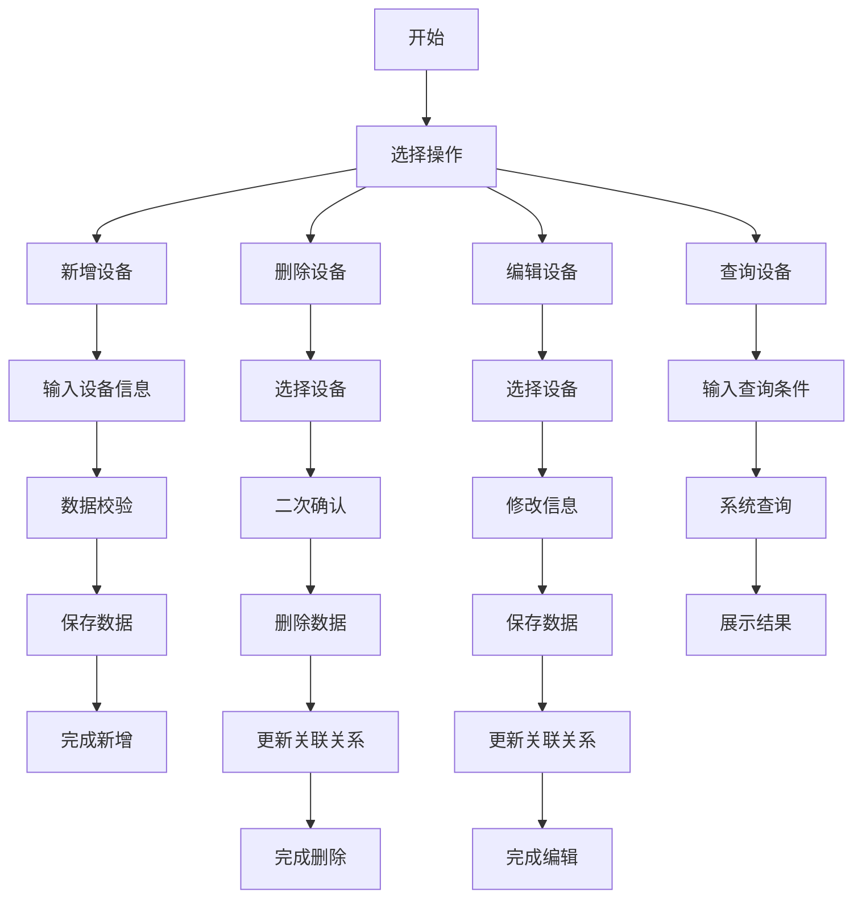
```mermaid
graph TD
    A[开始] --> B[选择操作]
    B --> C[新增设备]
    B --> D[删除设备]
    B --> E[编辑设备]
    B --> F[查询设备]
    C --> G[输入设备信息]
    G --> H[数据校验]
    H --> I[保存数据]
    I --> J[完成新增]
    D --> K[选择设备]
    K --> L[二次确认]
    L --> M[删除数据]
    M --> N[更新关联关系]
    N --> O[完成删除]
    E --> P[选择设备]
    P --> Q[修改信息]
    Q --> R[保存数据]
    R --> S[更新关联关系]
    S --> T[完成编辑]
    F --> U[输入查询条件]
    U --> V[系统查询]
    V --> W[展示结果]
```
#### 4.3.3.3. 输入输出

| 名称     | I/O | 内容                                                                                         |
| -------- | --- | -------------------------------------------------------------------------------------------- |
| 输入参数 | I   | 新增设备的各项信息；编辑设备的修改信息；设备编号、设备类型、所在位置、左右幅、状态等查询条件 |
| 输出参数 | O   | 新增或编辑结果提示、设备详细信息、查询结果列表                                               |

#### 4.3.3.4. 页面交互
- **新增设备**：在新增页面，用户填写设备信息，点击保存按钮，系统进行数据校验，成功后保存数据并提示新增成功。
- **删除设备**：在列表页面，用户选择要删除的设备，点击删除按钮，系统进行二次确认，确认后删除数据并更新关联关系。
- **编辑设备**：在列表页面，用户选择要编辑的设备，进入编辑页面修改信息，点击保存按钮，系统保存数据并更新关联关系。
- **查询设备**：在查询页面，用户输入查询条件，点击查询按钮，系统展示查询结果列表，可进行数据导出操作。

#### 4.3.3.5. 业务数据描述
| 序号 | 业务对象 | 涉及数据属性                                                                               |
| ---- | -------- | ------------------------------------------------------------------------------------------ |
| 1    | 其他设备 | 设备编号、设备类型、设备名称、所在位置、左右幅、生产商、型号、安装日期、设备照片、当前状态 |

#### 4.3.3.6. ER图
```mermaid
erDiagram
    OTHER_DEVICE {
        string id PK
        string bridgeId FK
        string type
        string name
        string location
        string side
        string manufacturer
        string model
        timestamp installDate
        string status
        string photo
        timestamp createTime
        timestamp updateTime
        int2 delFlag
        string createBy
        string updateBy
    }
```

## 4.4. 数据监测模块
### 4.4.1. 用例图
```mermaid
graph TD
    A[桥梁管理员] --> B[传感器监测]
    A --> C[称重监测]
```
### 4.4.2. 传感器监测
#### 4.4.2.1. 功能描述
1. **实时数据展示**
- 功能编号：E001
- 功能分类：数据监测
- 功能名称：实时数据展示
- 用户角色：桥梁管理员、监测工程师
- 功能说明：
  > 以折线图展示环境量监测（如温度、湿度等）、横纵向位移、支座脱空、墩柱倾斜、梁体不均匀沉降、梁体裂缝、梁体震动、结构应变等传感器的实时监测数据和统计数据。可动态加载实时数据展示在图表，可动态设置图表的数据标签、预警线。
- 前置条件：用户已登录系统，传感器正常工作且数据已采集，系统已获取相关数据。
- 后置条件：系统展示实时监测数据和统计数据的折线图，图表根据设置更新。
- 业务规则：数据展示需准确、及时，预警线设置需符合相关标准和规定。
- 补充说明：无

#### 4.4.2.2. 流程描述
```mermaid
graph TD
    A[开始] --> B[选择传感器类型]
    B --> C[获取实时数据]
    C --> D[绘制折线图]
    D --> E[设置图表参数]
    E --> F[展示图表]
```

#### 4.4.2.3. 输入输出

| 名称     | I/O | 内容                                               |
| -------- | --- | -------------------------------------------------- |
| 输入参数 | I   | 传感器类型选择；图表参数设置（数据标签、预警线等） |
| 输出参数 | O   | 实时监测数据和统计数据的折线图                     |

#### 4.4.2.4. 页面交互
- 在数据监测页面，用户选择要查看的传感器类型，系统获取相应实时数据并绘制折线图。
- 用户可通过界面操作设置图表的数据标签、预警线等参数，图表实时更新展示。

#### 4.4.2.5. 业务数据描述
| 序号 | 业务对象       | 涉及数据属性                                                                              |
| ---- | -------------- | ----------------------------------------------------------------------------------------- |
| 1    | 传感器监测数据 | 传感器编号、监测时间、监测数据值（温度、位移、应变等具体监测数据）、数据状态（正常/异常） |

#### 4.4.2.6. ER图
```mermaid
erDiagram
    SENSOR_DATA {
        string id PK
        string sensorId FK
        timestamp time
        float8 value
        string status
    }
```

### 4.4.3. 称重监测
#### 4.4.3.1. 功能描述
1. **数据展示与车辆图片预览**
- 功能编号：E002
- 功能分类：数据监测
- 功能名称：数据展示与车辆图片预览
- 用户角色：桥梁管理员、监测工程师
- 功能说明：
  > 按轴数、重量分别以折线图、表格方式展示桥梁称重数据，可在线预览抓拍车辆图片。
- 前置条件：称重设备正常工作且数据已采集，系统已获取相关数据，车辆抓拍图片已存储。
- 后置条件：系统展示称重数据的折线图和表格，可查看车辆图片。
- 业务规则：数据展示需准确、清晰，图片预览功能正常。
- 补充说明：无

#### 4.4.3.2. 流程描述
```mermaid
graph TD
    A[开始] --> B[获取称重数据]
    B --> C[绘制折线图与生成表格]
    C --> D[展示数据]
    D --> E[选择车辆图片]
    E --> F[预览图片]
```

#### 4.4.3.3. 输入输出
| 名称     | I/O | 内容                                 |
| -------- | --- | ------------------------------------ |
| 输入参数 | I   | 无（自动获取称重数据和车辆图片）     |
| 输出参数 | O   | 称重数据的折线图、表格；车辆图片预览 |

#### 4.4.3.4. 页面交互
- 在称重监测页面，系统自动获取并展示称重数据的折线图和表格。
- 用户点击相关车辆记录，可进行车辆图片预览操作。

#### 4.4.3.5. 业务数据描述
| 序号 | 业务对象 | 涉及数据属性                         |
| ---- | -------- | ------------------------------------ |
| 1    | 称重数据 | 称重时间、轴数、重量                 |
| 2    | 车辆图片 | 图片编号、图片文件、关联称重记录编号 |

#### 4.4.3.6. ER图
```mermaid
erDiagram
    WEIGHING_DATA ||--o{ VEHICLE_IMAGE : has
```

## 4.5. 安全预警模块
### 4.5.1. 用例图
```mermaid
graph TD
    A[桥梁管理员] --> B[超限预警]
    A --> C[故障自诊断]
```
### 4.5.2. 超限预警
#### 4.5.2.1. 功能描述
1. **规则设置**
- 功能编号：F001
- 功能分类：安全预警
- 功能名称：规则设置
- 用户角色：桥梁管理员、监测工程师
- 功能说明：
  > 用户可自定义设置超限预警规则，设置内容包括传感器编号、监测物理量、数据类型、是否绝对值、预警等级、超限阈值、频次、预警说明。
- 前置条件：用户已登录系统，且具有规则设置权限。
- 后置条件：系统保存超限预警规则设置。
- 业务规则：设置参数需符合数据格式和业务逻辑，预警等级和阈值设置需合理。
- 补充说明：无

2. **预警跟踪**
- 功能编号：F002
- 功能分类：安全预警
- 功能名称：预警跟踪
- 用户角色：桥梁管理员、监测工程师
- 功能说明：
  > 可查看所有超限预警信息，可对超限预警信息进行处理及归档；处理超限预警信息时，需填写处置措施和上传相关附件；处理及确认后的超限预警信息，可进行归档。
- 前置条件：用户已登录系统，且具有预警跟踪权限，存在超限预警信息。
- 后置条件：超限预警信息状态更新，处置措施和附件记录保存，可进行归档操作。
- 业务规则：处置措施填写需详细、准确，附件格式需符合要求。
- 补充说明：无

3. **预警日志**
- 功能编号：F003
- 功能分类：安全预警
- 功能名称：预警日志
- 用户角色：桥梁管理员、监测工程师
- 功能说明：
  > 查看所有归档的超限预警记录信息。
- 前置条件：用户已登录系统，且具有查看权限，存在归档的超限预警记录。
- 后置条件：系统展示归档的超限预警记录信息。
- 业务规则：无
- 补充说明：无

#### 4.5.2.2. 流程描述
1. **规则设置流程**
```mermaid
graph TD
    A[开始] --> B[进入规则设置页面]
    B --> C[输入规则参数]
    C --> D[数据校验]
    D --> E[保存规则]
    E --> F[完成设置]
```

2. **预警跟踪流程**
```mermaid
graph TD
    A[开始] --> B[查看超限预警信息]
    B --> C[选择预警信息]
    C --> D[处理预警]
    D --> E[填写处置措施]
    E --> F[上传附件]
    F --> G[确认处理]
    G --> H[判断是否归档]
    H --> I[是，进行归档]
    H --> J[否，继续跟踪]
```

3. **预警日志查看流程**
```mermaid
graph TD
    A[开始] --> B[进入预警日志页面]
    B --> C[系统查询归档记录]
    C --> D[展示预警日志]
```

#### 4.5.2.3. 输入输出

| 名称     | I/O | 内容                                                           |
| -------- | --- | -------------------------------------------------------------- |
| 输入参数 | I   | 规则设置的各项参数；预警处理的处置措施、附件                   |
| 输出参数 | O   | 规则设置成功提示；超限预警信息列表、处置结果提示、预警日志记录 |

#### 4.5.2.4. 页面交互
- **规则设置**：在规则设置页面，用户输入各项参数，点击保存按钮，系统校验后保存规则。
- **预警跟踪**：在预警跟踪页面，用户查看预警信息列表，选择预警进行处理，填写处置措施并上传附件，确认后可进行归档操作。
- **预警日志**：在预警日志页面，系统展示归档记录列表。

#### 4.5.2.5. 业务数据描述
| 序号 | 业务对象     | 涉及数据属性                                                                                                |
| ---- | ------------ | ----------------------------------------------------------------------------------------------------------- |
| 1    | 超限预警规则 | 规则编号、传感器编号、监测物理量、数据类型、是否绝对值、预警等级、超限阈值、频次、预警说明                  |
| 2    | 超限预警信息 | 预警编号、传感器编号、预警时间、预警等级、监测数据值、处置措施、附件编号、处理状态（未处理/已处理/已归档） |
| 3    | 预警日志     | 日志编号、预警编号、查看时间                                                                                |

#### 4.5.2.6. ER图
```mermaid
erDiagram
    OVERRUN_WARNING_RULE ||--o{ OVERRUN_WARNING_INFO : generates
    OVERRUN_WARNING_INFO ||--|| WARNING_LOG : has
```

### 4.5.3. 故障自诊断
#### 4.5.3.1. 功能描述
1. **规则设置**
- 功能编号：F004
- 功能分类：安全预警
- 功能名称：规则设置
- 用户角色：桥梁管理员、监测工程师
- 功能说明：
  > 用户可自定义设置离线预警规则，可按采集组设置，设置内容包括传感器类型、传感器编号、上限值、下限值、持续时长。可设置是否启用规则。
- 前置条件：用户已登录系统，且具有规则设置权限。
- 后置条件：系统保存离线预警规则设置。
- 业务规则：设置参数需符合数据格式和业务逻辑，上限值、下限值和持续时长设置需合理。
- 补充说明：无

2. **预警跟踪**
- 功能编号：F005
- 功能分类：安全预警
- 功能名称：预警跟踪
- 用户角色：桥梁管理员、监测工程师
- 功能说明：
  > 可查看所有离线预警信息，可对离线预警信息进行处理及归档；处理离线预警信息时，需填写处置措施和上传相关附件；处理及确认后的离线预警信息，可进行归档。
- 前置条件：用户已登录系统，且具有预警跟踪权限，存在离线预警信息。
- 后置条件：离线预警信息状态更新，处置措施和附件记录保存，可进行归档操作。
- 业务规则：处置措施填写需详细、准确，附件格式需符合要求。
- 补充说明：无

3. **预警日志**
- 功能编号：F006
- 功能分类：安全预警
- 功能名称：预警日志
- 用户角色：桥梁管理员、监测工程师
- 功能说明：
  > 查看所有归档的离线预警记录信息。
- 前置条件：用户已登录系统，且具有查看权限，存在归档的离线预警记录。
- 后置条件：系统展示归档的离线预警记录信息。
- 业务规则：无
- 补充说明：无

#### 4.5.3.2. 流程描述
1. **规则设置流程**
```mermaid
graph TD
    A[开始] --> B[进入规则设置页面]
    B --> C[输入规则参数]
    C --> D[数据校验]
    D --> E[保存规则]
    E --> F[完成设置]
```

2. **预警跟踪流程**
```mermaid
graph TD
    A[开始] --> B[查看离线预警信息]
    B --> C[选择预警信息]
    C --> D[处理预警]
    D --> E[填写处置措施]
    E --> F[上传附件]
    F --> G[确认处理]
    G --> H[判断是否归档]
    H --> I[是，进行归档]
    H --> J[否，继续跟踪]
```

3. **预警日志查看流程**
```mermaid
graph TD
    A[开始] --> B[进入预警日志页面]
    B --> C[系统查询归档记录]
    C --> D[展示预警日志]
```

#### 4.5.3.3. 输入输出
| 名称     | I/O | 内容                                                           |
| -------- | --- | -------------------------------------------------------------- |
| 输入参数 | I   | 规则设置的各项参数；预警处理的处置措施、附件                   |
| 输出参数 | O   | 规则设置成功提示；离线预警信息列表、处置结果提示、预警日志记录 |

#### 4.5.3.4. 页面交互
- **规则设置**：在规则设置页面，用户输入各项参数，点击保存按钮，系统校验后保存规则。
- **预警跟踪**：在预警跟踪页面，用户查看预警信息列表，选择预警进行处理，填写处置措施并上传附件，确认后可进行归档操作。
- **预警日志**：在预警日志页面，系统展示归档记录列表。

#### 4.5.3.5. 业务数据描述
| 序号 | 业务对象     | 涉及数据属性                                                                         |
| ---- | ------------ | ------------------------------------------------------------------------------------ |
| 1    | 离线预警规则 | 规则编号、传感器类型、传感器编号、上限值、下限值、持续时长、是否启用                 |
| 2    | 离线预警信息 | 预警编号、传感器编号、预警时间、处置措施、附件编号、处理状态（未处理/已处理/已归档） |
| 3    | 预警日志     | 日志编号、预警编号、查看时间                                                         |

#### 4.5.3.6. ER图
```mermaid
erDiagram
    OFFLINE_WARNING_RULE ||--o{ OFFLINE_WARNING_INFO : generates
    OFFLINE_WARNING_INFO ||--|| WARNING_LOG : has
```

## 4.6. 视频监控模块
### 4.6.1. 用例图
```mermaid
graph TD
    A[桥梁管理员] --> B[监控列表]
    A --> C[实时预览]
```
### 4.6.2. 监控列表
#### 4.6.2.1. 功能描述
1. **展示监控信息**
- 功能编号：G001
- 功能分类：视频监控
- 功能名称：展示监控信息
- 用户角色：桥梁管理员
- 功能说明：
  > 展示系统目前所配置的视频监控信息，包括摄像头编号、摄像头描述等信息，可根据视频点位实际建设情况动态配置视频监控信息。
- 前置条件：系统已接入视频监控设备，且设备正常运行，用户已登录系统。
- 后置条件：系统展示视频监控信息列表。
- 业务规则：信息展示需准确、及时，与实际设备配置一致。
- 补充说明：无

#### 4.6.2.2. 流程描述
```mermaid
graph TD
    A[开始] --> B[系统获取监控信息]
    B --> C[展示信息列表]
```

#### 4.6.2.3. 输入输出
| 名称     | I/O | 内容                                         |
| -------- | --- | -------------------------------------------- |
| 输入参数 | I   | 无（自动获取监控信息）                       |
| 输出参数 | O   | 视频监控信息列表（摄像头编号、摄像头描述等） |
#### 4.6.2.4. 页面交互
- 在视频监控页面，系统自动展示监控信息列表。
#### 4.6.2.5. 业务数据描述
| 序号 | 业务对象     | 涉及数据属性                                     |
| ---- | ------------ | ------------------------------------------------ |
| 1    | 视频监控设备 | 设备编号、设备名称、设备位置、设备状态、连接信息 |

#### 4.6.2.6. ER图
```mermaid
erDiagram
    VIDEO_DEVICE {
        string id PK
        string name
        string location
        string status
        string connectionInfo
    }
```

### 4.6.3. 实时预览
#### 4.6.3.1. 功能描述
1. **视频实时播放**
- 功能编号：G002
- 功能分类：视频监控
- 功能名称：视频实时播放
- 用户角色：桥梁管理员
- 功能说明：
  > 点击视频监控列表信息，可在系统上直接预览视频信息，支持多个视频同时播放。
- 前置条件：系统已接入视频监控设备，且设备正常运行，用户已登录系统，所选视频监控信息存在。
- 后置条件：系统播放所选视频监控的实时画面。
- 业务规则：视频播放需流畅、清晰，支持多视频播放时的画面切换和管理。
- 补充说明：无

#### 4.6.3.2. 流程描述
```mermaid
graph TD
    A[开始] --> B[选择视频监控]
    B --> C[系统连接视频源]
    C --> D[播放视频]
```

#### 4.6.3.3. 输入输出
| 名称     | I/O | 内容                               |
| -------- | --- | ---------------------------------- |
| 输入参数 | I   | 所选视频监控的标识（如设备编号等） |
| 输出参数 | O   | 视频实时播放画面                   |

#### 4.6.3.4. 页面交互
- 在监控列表页面，用户点击要预览的视频监控项，系统弹出视频播放窗口进行实时播放。用户可通过界面操作控制视频播放（如暂停、播放、切换等）。

#### 4.6.3.5. 业务数据描述
| 序号 | 业务对象     | 涉及数据属性                                                                                     |
| ---- | ------------ | ------------------------------------------------------------------------------------------------ |
| 1    | 视频播放记录 | 播放开始时间、播放结束时间、播放时长、播放设备编号、用户操作记录（暂停、播放、切换等操作及时间） |

#### 4.6.3.6. ER图
```mermaid
erDiagram
    VIDEO_PLAYBACK_RECORD {
        string id PK
        timestamp startTime
        timestamp endTime
        int2 duration
        string videoDeviceId FK
        string operationRecords
    }
```

## 4.7. 系统维护模块
### 4.7.1. 用例图
```mermaid
graph TD
    A[桥梁管理员] --> B[维护申报]
    A --> C[维护日志]
```

### 4.7.2. 维护申报
#### 4.7.2.1. 功能描述
1. **展示维护记录**
- 功能编号：H001
- 功能分类：系统维护
- 功能名称：展示维护记录
- 用户角色：桥梁管理员
- 功能说明：
  > 展示系统维护所有记录的基本信息，包括传感器编号、申报日期、申报内容、处置措施等。系统可以根据维护记录的申报时间、传感器编号进行筛选，可查看该维护记录的详细信息（包括照片等），可以修改该条维护记录的详细内容（包括重新上传照片，编写处置措施），可以新增一条维护记录（录入相关详细信息，可以上传照片），将已经处置的维护记录进行归档处理，该条记录将被归档到【维护日志】中。
- 前置条件：系统已存在维护记录，用户已登录系统。
- 后置条件：系统根据操作展示或更新维护记录相关信息。
- 业务规则：信息展示需准确、完整，筛选条件需有效，修改和新增记录需符合数据格式要求。
- 补充说明：无

#### 4.7.2.2. 流程描述
1. **展示记录流程**
```mermaid
graph TD
    A[开始] --> B[系统获取维护记录]
    B --> C[展示记录列表]
```

2. **筛选记录流程**
```mermaid
graph TD
    A[开始] --> B[输入筛选条件]
    B --> C[系统根据条件筛选]
    C --> D[展示筛选结果]
```

3. **查看详细信息流程**
```mermaid
graph TD
    A[开始] --> B[选择维护记录]
    B --> C[系统获取详细信息]
    C --> D[展示详细信息]
```

4. **修改记录流程**
```mermaid
graph TD
    A[开始] --> B[选择维护记录]
    B --> C[修改记录内容]
    C --> D[保存修改]
    D --> E[更新记录]
```

5. **新增记录流程**
```mermaid
graph TD
    A[开始] --> B[进入新增页面]
    B --> C[输入记录信息]
    C --> D[上传照片（可选）]
    D --> E[保存记录]
    E --> F[完成新增]
```

6. **归档记录流程**
```mermaid
graph TD
    A[开始] --> B[选择已处置记录]
    B --> C[执行归档操作]
    C --> D[记录转移到维护日志]
```
#### 4.7.2.3. 输入输出
| 名称     | I/O | 内容                                                                                     |
| -------- | --- | ---------------------------------------------------------------------------------------- |
| 输入参数 | I   | 筛选条件（申报时间、传感器编号等）；修改记录的新内容、新增记录的各项信息、上传的照片     |
| 输出参数 | O   | 维护记录列表、筛选结果列表、记录详细信息、操作结果提示（修改成功、新增成功、归档成功等） |

#### 4.7.2.4. 页面交互
- 在维护申报页面，系统展示维护记录列表，用户可进行筛选、查看详细信息、修改、新增和归档等操作。操作过程中，页面根据用户输入和系统反馈及时更新展示内容。

#### 4.7.2.5. 业务数据描述
| 序号 | 业务对象 | 涉及数据属性                                                                                   |
| ---- | -------- | ---------------------------------------------------------------------------------------------- |
| 1    | 维护记录 | 记录编号、传感器编号、申报日期、申报内容、处置措施、照片文件、记录状态（未处理/已处理/已归档） |

#### 4.7.2.6. ER图
```mermaid
erDiagram
    MAINTENANCE_RECORD {
        string id PK
        string sensorId FK
        timestamp applicationDate
        string content
        string disposalMeasures
        string photo
        string status
    }
```

### 4.7.3. 维护日志
#### 4.7.3.1. 功能描述
1. **查看归档记录**
- 功能编号：H002
- 功能分类：系统维护
- 功能名称：查看归档记录
- 用户角色：桥梁管理员
- 功能说明：
  > 显示所有系统维护中已经被归档的记录，包括传感器编号、申报日期、申报内容、处置措施等。可以根据维护记录的申报时间、设备类型进行筛选，可以查看该维护记录的详细信息（包括照片等），可以删除某条归档记录。
- 前置条件：系统存在已归档的维护记录，用户已登录系统。
- 后置条件：系统根据操作展示或更新归档记录相关信息。
- 业务规则：信息展示需准确、完整，筛选条件需有效，删除操作需谨慎并进行二次确认。
- 补充说明：无

#### 4.7.3.2. 流程描述
1. **查看记录流程**
```mermaid
graph TD
    A[开始] --> B[系统获取归档记录]
    B --> C[展示记录列表]
```

2. **筛选记录流程**
```mermaid
graph TD
    A[开始] --> B[输入筛选条件]
    B --> C[系统根据条件筛选]
    C --> D[展示筛选结果]
```

3. **查看详细信息流程**
```mermaid
graph TD
    A[开始] --> B[选择归档记录]
    B --> C[系统获取详细信息]
    C --> D[展示详细信息]
```

4. **删除记录流程**
```mermaid
graph TD
    A[开始] --> B[选择归档记录]
    B --> C[二次确认删除]
    C --> D[删除记录]
    D --> E[更新记录列表]
```

#### 4.7.3.3. 输入输出
| 名称     | I/O | 内容                                                                 |
| -------- | --- | -------------------------------------------------------------------- |
| 输入参数 | I   | 筛选条件（申报时间、设备类型等）；二次确认信息（用于删除操作）       |
| 输出参数 | O   | 归档记录列表、筛选结果列表、记录详细信息、操作结果提示（删除成功等） |

#### 4.7.3.4. 页面交互
- 在维护日志页面，系统展示归档记录列表，用户可进行筛选、查看详细信息和删除等操作。页面根据用户操作实时响应，如更新列表、展示详细信息或提示操作结果。

#### 4.7.3.5. 业务数据描述
| 序号 | 业务对象     | 涉及数据属性                                                 |
| ---- | ------------ | ------------------------------------------------------------ |
| 1    | 维护日志记录 | 日志编号、传感器编号、申报日期、申报内容、处置措施、照片文件 |

#### 4.7.3.6. ER图
```mermaid
erDiagram
    MAINTENANCE_LOG {
        string id PK
        string sensorId FK
        timestamp applicationDate
        string content
        string disposalMeasures
        string photo
    }
```

## 4.8. 系统管理模块
### 4.8.1. 用例图
```mermaid
graph TD
    A[系统管理员] --> B[菜单管理]
    A --> C[用户管理]
    A --> D[系统角色]
    A --> E[数据字典]
```
### 4.8.2. 菜单管理
#### 4.8.2.1. 功能描述
1. **菜单操作**
- 功能编号：I001
- 功能分类：系统管理
- 功能名称：菜单管理
- 用户角色：系统管理员
- 功能说明：
  > 支持对系统的菜单信息进行管理，管理员可以根据业务应用需求，操作菜单的新增、修改和删除等，调整系统功能布局。
- 前置条件：用户已登录系统，且具有菜单管理权限。
- 后置条件：系统菜单信息更新，功能布局相应改变。
- 业务规则：菜单操作需谨慎，确保系统功能正常运行，新增菜单需符合系统架构和业务逻辑。
- 补充说明：无

#### 4.8.2.2. 流程描述
1. **新增菜单流程**
```mermaid
graph TD
    A[开始] --> B[进入新增菜单页面]
    B --> C[输入菜单信息]
    C --> D[数据校验]
    D --> E[保存菜单]
    E --> F[更新菜单列表]
```

2. **修改菜单流程**
```mermaid
graph TD
    A[开始] --> B[选择要修改的菜单]
    B --> C[修改菜单信息]
    C --> D[保存修改]
    D --> E[更新菜单显示]
```

3. **删除菜单流程**
```mermaid
graph TD
    A[开始] --> B[选择要删除的菜单]
    B --> C[二次确认删除]
    C --> D[删除菜单]
    D --> E[调整菜单布局]
```

#### 4.8.2.3. 输入输出
| 名称     | I/O | 内容                                                                                       |
| -------- | --- | ------------------------------------------------------------------------------------------ |
| 输入参数 | I   | 新增菜单的各项信息（菜单名称、菜单链接、菜单图标等）；修改菜单的新信息；删除菜单的确认操作 |
| 输出参数 | O   | 操作结果提示（新增成功、修改成功、删除成功等）；更新后的菜单列表                           |

#### 4.8.2.4. 页面交互
- 在菜单管理页面，管理员可以看到系统当前的菜单结构。点击新增按钮进入新增菜单页面，填写相关信息并保存；选择要修改的菜单进行信息修改并保存；选择要删除的菜单进行二次确认后删除。页面实时更新菜单显示和操作结果提示。

#### 4.8.2.5. 业务数据描述
| 序号 | 业务对象 | 涉及数据属性                                                                        |
| ---- | -------- | ----------------------------------------------------------------------------------- |
| 1    | 菜单     | 菜单编号、菜单名称、菜单链接、菜单图标、父菜单编号、菜单排序、菜单状态（启用/禁用） |

#### 4.8.2.6. ER图
```mermaid
erDiagram
    MENU {
        string id PK
        string name
        string link
        string icon
        string parentId
        int2 orderNumber
        bool status
    }
```

### 4.8.3. 用户管理
#### 4.8.3.1. 功能描述
1. **用户操作**
- 功能编号：I002
- 功能分类：系统管理
- 功能名称：用户管理
- 用户角色：系统管理员
- 功能说明：
  > 用户管理是确保系统安全性的重要环节。对于不同权限的用户，系统会根据其角色分配相应的功能权限，确保每位用户都能在其权限范围内使用系统。包括用户查询、用户新增、用户维护（编辑、重置密码或删除用户）等功能。管理员可以修改用户的基本信息，同时也可调整用户的角色归属，以改变其权限范围；用于处理不再需要访问系统的用户账户，以维护系统用户列表的整洁和安全性。
- 前置条件：用户已登录系统，且具有用户管理权限。
- 后置条件：系统用户信息更新，权限分配相应改变。
- 业务规则：用户操作需符合系统安全策略，新增用户信息需准确、完整，删除用户需谨慎并确保数据安全。
- 补充说明：无

#### 4.8.3.2. 流程描述
1. **用户查询流程**
```mermaid
graph TD
    A[开始] --> B[输入查询条件]
    B --> C[系统查询用户]
    C --> D[展示用户列表]
```

2. **用户新增流程**
```mermaid
graph TD
    A[开始] --> B[进入新增用户页面]
    B --> C[输入用户信息]
    C --> D[设置用户权限]
    D --> E[保存用户]
    E --> F[完成新增]
```

3. **用户维护流程（编辑、重置密码）**
```mermaid
graph TD
    A[开始] --> B[选择要维护的用户]
    B --> C[修改用户信息或重置密码]
    C --> D[保存修改]
    D --> E[更新用户信息]
```

4. **用户删除流程**
```mermaid
graph TD
    A[开始] --> B[选择要删除的用户]
    B --> C[二次确认删除]
    C --> D[删除用户]
    D --> E[更新用户列表]
```

#### 4.8.3.3. 输入输出
| 名称     | I/O | 内容                                                                                                                                                   |
| -------- | --- | ------------------------------------------------------------------------------------------------------------------------------------------------------ |
| 输入参数 | I   | 查询条件（用户名、用户编号、用户状态等）；新增用户的各项信息（用户名、密码、姓名、联系方式等）；编辑用户的新信息；重置密码的新密码；删除用户的确认操作 |
| 输出参数 | O   | 查询结果列表；操作结果提示（新增成功、修改成功、删除成功等）；更新后的用户列表                                                                         |

#### 4.8.3.4. 页面交互
- 在用户管理页面，管理员可以进行用户查询操作，输入查询条件后系统展示查询结果列表。点击新增按钮进入新增用户页面，填写信息并设置权限后保存；选择要维护的用户进行信息修改或密码重置；选择要删除的用户进行二次确认后删除。页面实时反馈操作结果和更新用户列表。
#### 4.8.3.5. 业务数据描述
| 序号 | 业务对象 | 涉及数据属性                                                            |
| ---- | -------- | ----------------------------------------------------------------------- |
| 1    | 用户     | 用户编号、用户名、密码、姓名、联系方式、用户状态（启用/禁用）、角色编号 |

#### 4.8.3.6. ER图
```mermaid
erDiagram
    USER {
        string id PK
        string username
        string password
        string name
        string contact
        bool status
        string roleId FK
    }
```

### 4.8.4. 系统角色
#### 4.8.4.1. 功能描述
1. **角色管理**
- 功能编号：I003
- 功能分类：系统管理
- 功能名称：系统角色
- 用户角色：系统管理员
- 功能说明：
  > 角色管理是系统权限控制的核心组成部分，确保了不同用户群体能够根据其职责和需要访问相应的系统资源。系统提供角色的增删查改功能，包括管理员可快速检索和了解当前系统中定义的所有角色及其详细信息；系统支持角色新增，使得随着组织结构的调整或新业务需求的出现，能够灵活添加新的角色定义；系统支持对已有角色编辑（修改角色名称、描述或重新分配权限）和角色删除（当某个角色不再需要时，可以安全地将其从系统中移除）。对于不同的角色，能通过资源权限的分配，实现功能集合的规范化管理，使系统使用更加友好便利。角色设置可根据实际进行调整，一般保留超级管理员（拥有系统最高权限，可进行全局配置和管理）、机构管理员（负责管理特定机构）等主要角色。
- 前置条件：用户已登录系统，且具有系统角色管理权限。
- 后置条件：系统角色信息更新，权限分配相应改变。
- 业务规则：角色操作需谨慎，确保系统权限控制合理，新增角色需明确其职责和权限范围。
- 补充说明：无

#### 4.8.4.2. 流程描述
1. **角色查询流程**
```mermaid
graph TD
    A[开始] --> B[输入查询条件]
    B --> C[系统查询角色]
    C --> D[展示角色列表]
```

2. **角色新增流程**
```mermaid
graph TD
    A[开始] --> B[进入新增角色页面]
    B --> C[输入角色信息]
    C --> D[设置角色权限]
    D --> E[保存角色]
    E --> F[完成新增]
```

3. **角色编辑流程**
```mermaid
graph TD
    A[开始] --> B[选择要编辑的角色]
    B --> C[修改角色信息或权限]
    C --> D[保存修改]
    D --> E[更新角色信息]
```

4. **角色删除流程**
```mermaid
graph TD
    A[开始] --> B[选择要删除的角色]
    B --> C[二次确认删除]
    C --> D[删除角色]
    D --> E[更新角色列表]
```
#### 4.8.4.3. 输入输出
| 名称     | I/O | 内容                                                                                                                     |
| -------- | --- | ------------------------------------------------------------------------------------------------------------------------ |
| 输入参数 | I   | 查询条件（角色名称、角色编号等）；新增角色的各项信息（角色名称、角色描述等）；编辑角色的新信息或权限；删除角色的确认操作 |
| 输出参数 | O   | 查询结果列表；操作结果提示（新增成功、修改成功、删除成功等）；更新后的角色列表                                           |

#### 4.8.4.4. 页面交互
- 在系统角色管理页面，管理员可以进行角色查询操作，输入查询条件后系统展示查询结果列表。点击新增按钮进入新增角色页面，填写信息并设置权限后保存；选择要编辑的角色进行信息修改或权限调整；选择要删除的角色进行二次确认后删除。页面实时反馈操作结果和更新角色列表。
#### 4.8.4.5. 业务数据描述
| 序号 | 业务对象 | 涉及数据属性                           |
| ---- | -------- | -------------------------------------- |
| 1    | 系统角色 | 角色编号、角色名称、角色描述、权限列表 |

#### 4.8.4.6. ER图
```mermaid
erDiagram
    SYSTEM_ROLE {
        string id PK
        string name
        string description
        string permissionList
    }
```

### 4.8.5. 数据字典
#### 4.8.5.1. 功能描述
1. **字典管理**
- 功能编号：I004
- 功能分类：系统管理
- 功能名称：数据字典
- 用户角色：系统管理员
- 功能说明：
  > 维护系统所使用的数据字段，可查询、新增、修改、配置字典信息。
- 前置条件：用户已登录系统，且具有数据字典管理权限。
- 后置条件：系统数据字典信息更新。
- 业务规则：字典操作需遵循数据一致性和规范性原则，新增和修改的字典信息需符合系统数据标准。
- 补充说明：无

#### 4.8.5.2. 流程描述
1. **字典查询流程**
```mermaid
graph TD
    A[开始] --> B[输入查询条件]
    B --> C[系统查询字典信息]
    C --> D[展示字典列表]
```

2. **字典新增流程**
```mermaid
graph TD
    A[开始] --> B[进入新增字典项页面]
    B --> C[输入字典信息]
    C --> D[数据校验]
    D --> E[保存字典项]
    E --> F[更新字典列表]
```

3. **字典修改流程**
```mermaid
graph TD
    A[开始] --> B[选择要修改的字典项]
    B --> C[修改字典信息]
    C --> D[保存修改]
    D --> E[更新字典显示]
```

4. **字典配置流程（如设置字段属性等）**
```mermaid
graph TD
    A[开始] --> B[选择要配置的字典项]
    B --> C[设置字典属性]
    C --> D[保存配置]
    D --> E[更新字典配置信息]
```

#### 4.8.5.3. 输入输出
| 名称     | I/O | 内容                                                                                                                             |
| -------- | --- | -------------------------------------------------------------------------------------------------------------------------------- |
| 输入参数 | I   | 查询条件（字典项名称、字典类型等）；新增字典项的各项信息（字典项名称、字典值、字典描述等）；修改字典项的新信息；字典配置的新属性 |
| 输出参数 | O   | 查询结果列表；操作结果提示（新增成功、修改成功、配置成功等）；更新后的字典列表和字典配置信息                                     |

#### 4.8.5.4. 页面交互
- 在数据字典管理页面，管理员可以进行字典查询操作，输入查询条件后系统展示查询结果列表。点击新增按钮进入新增字典项页面，填写信息并校验后保存；选择要修改的字典项进行信息修改；选择要配置的字典项进行属性设置。页面实时更新字典显示、列表和配置信息，并反馈操作结果。
- 
#### 4.8.5.5. 业务数据描述
| 序号 | 业务对象   | 涉及数据属性                                                                           |
| ---- | ---------- | -------------------------------------------------------------------------------------- |
| 1    | 数据字典项 | 字典项编号、字典项名称、字典值、字典描述、字典类型、字段属性（如是否必填、数据格式等） |

#### 4.8.5.6. ER图
```mermaid
erDiagram
    DATA_DICTIONARY_ITEM {
        string id PK
        string name
        string value
        string description
        string type
        string fieldAttributes
    }
```

## 4.9. 数据处理服务

### 4.9.1. 系统接口实施内容
1. **与三维可视化大屏对接接口**
- 接口编号：J001
- 接口功能：实现桥梁健康监测系统与三维可视化大屏的数据交互，包括向大屏分享本系统产生的桥梁基础信息、各类告警信息、设备信息、监测数据等，以支持在大屏上进行直观、动态的展示。
- 接口实现方式：采用实时数据交换方式，双方商定互相认可的协议，在协议基础上开发数据接口进行系统互联，确保数据能够实时、准确地传输到大屏端进行展示。
- 接口输入输出参数：
  - 输入参数：无（由系统自动获取并推送相关数据）。
  - 输出参数：桥梁基础信息（如桥梁编码、桥梁简称、桥梁中心桩号、所在路线名称、桥梁全长等）、告警信息（包括传感器预警信息、超限预警信息、故障自诊断预警信息等，如预警编号、传感器编号、预警时间、预警等级、处置措施等）、设备信息（传感器设备信息如传感器编号、传感器类型、监测内容等；其他设备信息如设备编号、设备类型、设备名称等）、监测数据（传感器监测数据如温度、位移、应变等实时监测值；称重监测数据如轴数、重量等）。
- 接口调用示例：
```java
// 假设这是在桥梁健康监测系统中调用向三维可视化大屏推送数据的接口示例
try {
    // 调用接口方法，传入相关数据（此处数据获取和处理部分省略，实际应用中需根据系统逻辑获取准确数据）
    visualizationScreenInterface.pushData(bridgeInfo, warningInfo, deviceInfo, monitoringData);
    System.out.println("数据成功推送到三维可视化大屏");
} catch (Exception e) {
    System.out.println("推送数据到三维可视化大屏失败：" + e.getMessage());
}
```

### 4.9.2. 系统接口同步设计

#### 4.9.2.1. 传感器设备平台

##### 4.9.2.1.1. 传感器数据采集
1. **数据采集流程**
- 启动程序后，首先进行配置处理，通过`confutils.HandleConfig`函数读取并解析配置文件（如示例中的`sample3.yml`），获取相关配置参数，如日志记录相关配置、MQTT连接参数、数据库连接参数等，用于后续程序运行的初始化设置。
- 初始化日志记录器，包括普通日志记录器`LLog`和远程日志记录器`TeleLog`，根据传入的日志级别（如`debug`、`info`、`warn`、`error`等）、日志文件路径及相关配置来确定日志记录的详细程度和存储位置。这有助于在数据采集过程中记录关键信息、错误信息等，方便后续的调试和问题排查。
- 建立与数据库的连接，使用`gopgsql.SqlOpen`函数初始化数据库连接，确保后续能够将采集到的数据准确存储到数据库中。同时，连接MinIO服务器，用于可能的数据存储或其他相关操作（如存储原始数据文件等）。
- 根据配置判断是否启用MQTT。若启用（`EnableMqtt`配置为`"1"`），则创建`gomqtt.NewMqttClient`实例，设置MQTT服务器的IP地址、用户名、密码和端口号，并指定要订阅的主题（`Topics`）。然后建立MQTT连接并启动订阅，通过`mqtt.Subscribe`函数开始监听设备厂家发布的MQTT主题消息，准备接收传感器数据。
- 根据配置判断是否启用HTTP服务。若启用（`EnableHttp`为`"1"`），则启动HTTP服务器，用于可能的外部数据交互或接口调用（例如接收控制指令、提供数据查询接口等）。
- 根据配置判断是否启用任务处理。若启用（`EnableTask`为`"1"`），则启动多个数据处理任务，包括`EtlSensorDataTask`（可能用于数据抽取、转换和加载处理）、`RunningSensorTask`（可能用于处理传感器运行状态相关数据）、`RunningSensorDataTask`（处理传感器实时数据）、`RunningSensorDataHisTask`（处理传感器历史数据）以及`EtlSensorData10Task`（可能是特定频率或类型的数据处理任务）。同时启动`MeasurePointTask`任务（可能用于处理测量点相关数据）。
- 在数据采集过程中，当传感器数据通过MQTT推送过来时，会根据预设的规则进行处理。对于低频数据和高频数据，分别进行相应的解析和处理操作。原始数据一方面会通过数据库连接入库，确保数据的持久化存储；另一方面，同步计算特征数据，例如对采集到的原始数据进行统计分析、数据转换等操作，得到能够反映传感器状态或桥梁结构特征的特征数据，然后将这些特征数据也入库存储，以便后续的数据分析和应用。

2. **同步机制与数据流向**
- 在数据采集过程中，与系统其他部分的数据同步主要通过数据库实现。采集到的原始数据和计算得到的特征数据及时写入数据库后，其他模块（如数据监测模块、安全预警模块等）可以从数据库中获取最新的数据进行处理和分析。例如，数据监测模块可以实时查询数据库中的传感器数据，以实现实时数据展示和趋势分析；安全预警模块可以根据预设的规则，从数据库中获取数据进行判断是否触发预警。
- 当数据库中的数据发生更新时，例如新的传感器数据入库或者特征数据重新计算后更新，相关模块能够及时感知到数据变化并进行相应操作。这种基于数据库的数据同步方式确保了系统各部分之间数据的一致性和及时性，同时也便于数据的管理和维护。系统可以通过数据库的事务机制等保证数据操作的原子性、一致性、隔离性和持久性，防止数据在同步过程中出现错误或不一致的情况。例如，在一个事务中完成原始数据入库和特征数据计算入库的操作，如果其中一个步骤失败，则整个事务回滚，保证数据的完整性。

# 5. 接口设计

## 5.1. 组件/包及关系图
```mermaid
graph TD
    A[桥梁管理] --> B[数据采集]
    B --> C[传感器数据]
    B --> D[监测数据]
    A --> E[预警管理]
    E --> F[阈值设置]
    E --> G[预警规则]
    A --> H[统计分析]
    H --> I[数据报表]
    H --> J[趋势分析]
    A --> K[系统管理]
    K --> L[用户权限]
    K --> M[基础配置]
```

## 5.2. 接口设计原则
1. 统一规范
  - 采用 RESTful 风格设计 API
  - 使用标准 HTTP 方法(GET/POST/PUT/DELETE)
  - 返回统一的 JSON 格式响应
2. 安全性
  - 所有接口需要进行身份认证
  - 敏感数据传输采用 HTTPS 加密
  - 实现接口访问频率限制
3. 可扩展性
  - 接口版本控制
  - 模块化设计,便于扩展
  - 预留接口扩展字段

## 5.3. 系统接口设计

### 5.3.1. 接口 URI 形式
`http[s]://{host[:port]}/api/v1/{module}/{resource}/{action}`

示例:
- 获取桥梁列表: GET /api/v1/bridge/list
- 新增桥梁: POST /api/v1/bridge/add
- 更新桥梁: PUT /api/v1/bridge/update
- 删除桥梁: DELETE /api/v1/bridge/delete/{id}

### 5.3.2. URI 项说明

| 参数     | 说明            | 示例           |
| -------- | --------------- | -------------- |
| host     | 服务器地址      | api.bridge.com |
| port     | 服务端口,默认80 | 8080           |
| version  | API版本号       | v1             |
| module   | 功能模块        | bridge         |
| resource | 资源名称        | list           |
| action   | 操作方法        | add            |

### 5.3.3. 访问规范

### 5.3.4. 关于 JSON 的约定
1. 命名规范
  - 使用驼峰命名法
  - 时间格式：ISO 8601
  - 布尔值使用 true/false
2. 数据类型
  - 字符串: UTF-8 编码
  - 数字: 整数或浮点数
  - 数组: []
  - 对象: {}

### 5.3.5. 通用结构定义说明

#### 5.3.5.1. 访问授权参数定义
调用者访问所有接口时，都应传入访问授权参数。参数通过请求头传入，定义如下表:

| 名称           | 类型   | 描述     | 附加说明                                                                                                                                                          |
| -------------- | ------ | -------- | ----------------------------------------------------------------------------------------------------------------------------------------------------------------- |
| X-Access-Token | string | 访问令牌 | Required。access_token 由统一服务提供方统一管理分配,调用方系统通过登记备案获得。如果服务提供者提供了动态更新令牌机制,则{access_token}应从相关接口获取并按时更新。 |

#### 5.3.5.2. 接口通用返回结果定义
本规范使用统一的Result<T>结构作为服务接口返回的顶层结构，接口通用返回结果定义如下表:

| 属性名称  | 类型    | 是否必选 | 含义说明       |
| --------- | ------- | -------- | -------------- |
| success   | boolean | 是       | 请求是否成功   |
| message   | string  | 否       | 返回处理消息   |
| code      | int     | 是       | 返回状态码     |
| result    | T       | 否       | 返回数据,泛型T |
| timestamp | long    | 是       | 响应时间戳     |

示例:
```json
{
  "success": true,
  "code": 200,
  "message": "操作成功",
  "result": {
    // 具体的业务数据
  }
}
```

## 5.4. 外部接口

### 5.4.1. 第三方系统接口

#### 5.4.1.1. 天气服务接口
- **接口说明**: 用于获取桥梁所在位置的实时天气数据，为监测数据分析提供环境参考
- **请求方式**: GET
- **接口地址**: `/api/v1/weather/current`
- **请求参数**:
```json
{
  "longitude": "float", // 经度
  "latitude": "float",  // 纬度
  "key": "string"      // API密钥
}
```
- **返回数据**:
```json
{
  "success": true,
  "code": 200,
  "result": {
    "temperature": "float",    // 温度
    "humidity": "float",       // 湿度
    "windSpeed": "float",      // 风速
    "rainfall": "float",       // 降雨量
    "updateTime": "datetime"   // 更新时间
  }
}
```

#### 5.4.1.2. GIS地图服务接口
- **接口说明**: 用于获取桥梁地理位置信息和地图展示
- **请求方式**: GET
- **接口地址**: `/api/v1/gis/map`
- **请求参数**:
```json
{
  "mapType": "string",   // 地图类型
  "zoom": "int",         // 缩放级别
  "center": {            // 中心点坐标
    "longitude": "float",
    "latitude": "float"
  }
}
```
- **返回数据**:
```json
{
  "success": true,
  "code": 200,
  "result": {
    "mapUrl": "string",      // 地图服务URL
    "mapKey": "string",      // 地图服务密钥
    "layers": ["string"]     // 可用图层列表
  }
}
```

### 5.4.2. 数据推送接口

#### 5.4.2.1. 预警信息推送接口
- **接口说明**: 向外部预警系统推送桥梁监测预警信息
- **请求方式**: POST
- **接口地址**: `/api/v1/warning/push`
- **请求参数**:
```json
{
  "warningId": "string",           // 预警ID
  "warningType": "string",         // 预警类型
  "warningLevel": "int",           // 预警等级
  "warningTime": "datetime",       // 预警时间
  "warningContent": "string",      // 预警内容
  "bridgeInfo": {                  // 桥梁信息
    "bridgeId": "string",
    "bridgeName": "string",
    "location": "string"
  },
  "sensorData": {                  // 传感器数据
    "sensorId": "string",
    "sensorType": "string",
    "value": "float"
  }
}
```
- **返回数据**:
```json
{
  "success": true,
  "code": 200,
  "result": {
    "pushId": "string",        // 推送ID
    "pushTime": "datetime",    // 推送时间
    "status": "string"         // 推送状态
  }
}
```

### 5.4.3. 数据同步接口

#### 5.4.3.1. 监测数据同步接口
- **接口说明**: 与上级监控平台进行监测数据同步
- **请求方式**: POST
- **接口地址**: `/api/v1/data/sync`
- **请求参数**:
```json
{
  "syncType": "string",          // 同步类型
  "startTime": "datetime",       // 开始时间
  "endTime": "datetime",         // 结束时间
  "dataType": ["string"],        // 数据类型列表
  "bridgeIds": ["string"]        // 桥梁ID列表
}
```
- **返回数据**:
```json
{
  "success": true,
  "code": 200,
  "result": {
    "syncId": "string",           // 同步任务ID
    "totalCount": "int",          // 总数据条数
    "successCount": "int",        // 成功同步条数
    "failCount": "int",           // 失败条数
    "syncTime": "datetime"        // 同步时间
  }
}
```

### 5.4.4. 接口安全设计

#### 5.4.4.1. 认证机制
- 所有外部接口必须进行身份认证
- 采用 Token + 时间戳 + 签名的认证方式
- Token 有效期限制，过期需要重新获取

#### 5.4.4.2. 数据加密
- 敏感数据传输采用 HTTPS 协议
- 关键字段采用 AES 加密
- 签名采用 SHA-256 算法

#### 5.4.4.3. 访问控制
- IP 白名单限制
- 接口调用频率限制
- 并发访问控制

#### 5.4.4.4. 日志记录
- 记录所有接口调用日志
- 记录异常访问信息
- 定期日志分析和审计

### 5.4.5. 接口性能要求

#### 5.4.5.1. 响应时间
- 普通接口响应时间 < 1s
- 数据同步接口响应时间 < 5s
- 批量操作接口响应时间 < 10s

#### 5.4.5.2. 并发处理
- 支持最少 100 个并发请求
- 队列处理机制，防止系统过载
- 超时处理机制，避免资源占用

#### 5.4.5.3. 可用性要求
- 接口可用性 > 99.9%
- 故障自动切换机制
- 接口降级策略

# 6. 系统性能设计
## 6.1. 性能指标
### 6.1.1. 响应时间
1. **用户操作响应时间**：系统对用户操作的正常响应时间不超过5秒。这意味着在用户执行如查询传感器数据、查看桥梁档案、进行设备管理操作等常规任务时，系统应能在5秒内给出反馈，确保用户操作的流畅性，减少等待时间，提高工作效率。例如，当用户点击查询某一时间段内的传感器监测数据时，系统应迅速处理请求，在5秒内将数据以图表或列表形式展示给用户。
2. **数据报表查询速度**：数据报表查询速度少于5秒。对于生成各类数据报表的操作，如统计桥梁在一定时期内的结构响应数据报表、称重监测数据报表等，系统需在5秒内完成数据检索、统计和报表生成工作，以便用户及时获取所需信息进行分析和决策。

### 6.1.2. 并发用户数
系统支持平均并发用户数不低于50个。在实际使用场景中，如多个桥梁管理员同时登录系统查看不同桥梁的监测数据、进行设备管理或处理预警信息，以及监测工程师同时进行数据监测和分析等操作时，系统能够稳定运行，确保每个用户的操作都能得到及时响应，不会因用户数量增加而出现明显的性能下降或卡顿现象。

### 6.1.3. 无故障率
1. **平均无故障率**：系统平均无故障率不低于99.5%。这要求系统在长时间运行过程中保持稳定可靠，减少因系统故障导致的服务中断或数据错误情况。例如，在一个月（以30天计算）的运行时间内，系统出现故障的时间累计不应超过43.2分钟（30天×24小时×60分钟×(1 - 99.5%)）。
2. **故障恢复时间**
- 一般故障，恢复系统正常运行所需时间不超过30分钟。如因网络临时波动导致部分数据传输不畅等轻微故障，系统应能在30分钟内自动恢复或通过简单的人工干预（如重启相关服务）恢复正常运行，确保对用户业务的影响最小化。
- 严重故障，不超过4小时。例如服务器硬件部分故障（如硬盘故障但有冗余备份）、软件核心模块出现异常等情况，系统运维团队应在4小时内采取有效措施修复故障，使系统恢复正常服务，期间可能需要进行数据恢复、系统配置调整等操作。
- 特别严重的故障，一般不超过24小时。如遭遇大规模自然灾害导致数据中心部分损坏、系统遭受严重网络攻击等极端情况，在24小时内完成系统的紧急修复和数据恢复工作，确保系统关键功能能够尽快恢复，减少对桥梁安全监测工作的长期影响。

### 6.1.4. 备份和恢复
1. **联机备份**：系统数据和业务数据可联机备份，即在系统正常运行过程中，不影响业务操作的前提下，定期对数据进行备份。备份频率可根据数据重要性和变化频率设定，如每小时对实时监测数据进行一次增量备份，每天对全量数据进行一次完整备份。备份数据存储在独立的存储设备或云端存储中，确保数据的安全性和可用性。
2. **联机恢复**：当出现数据丢失或损坏情况时，系统具备联机恢复功能，能够快速从备份中恢复数据。恢复过程应确保数据的完整性和一致性，例如在恢复数据库数据时，保证数据之间的关联关系正确，业务逻辑不受影响。系统应提供简单易用的恢复操作界面或命令，以便管理员在需要时能够及时进行数据恢复操作。

## 6.2. 性能优化措施
### 6.2.1. 硬件优化
1. **服务器配置优化**：根据系统性能需求和业务增长预期，合理配置服务器资源。例如，选用高性能的CPU（如4核及以上），以提高系统的数据处理能力；配备足够的内存（如16G及以上），确保系统在处理大量实时数据和并发请求时能够快速响应，避免因内存不足导致数据交换频繁，影响性能；提供足够的存储空间（如200G及以上），用于存储系统数据、日志文件、备份数据等，并根据数据增长情况及时进行磁盘扩容或增加存储设备。
2. **网络设备优化**：选用高性能的网络交换机和路由器，确保网络传输的稳定性和高速性。合理规划网络拓扑结构，减少网络延迟和数据传输瓶颈。例如，采用千兆以太网或更高带宽的网络连接服务器、存储设备和监测设备，确保传感器数据能够快速传输到服务器进行处理，同时保证系统各模块之间的数据交互高效流畅。

### 6.2.2. 软件优化
1. **数据库优化**
- 数据库设计优化：对数据库表结构进行合理设计，根据业务需求和数据访问特点，选择合适的数据库范式，避免数据冗余，提高数据查询和更新效率。例如，在传感器数据存储表中，合理设置索引字段（如传感器编号、监测时间等），加快数据检索速度。
- 查询优化：优化数据库查询语句，避免复杂的嵌套查询和全表扫描。对于频繁使用的查询操作，可采用缓存机制（如Redis缓存），将查询结果缓存一段时间，减少对数据库的重复查询，提高响应速度。例如，对于经常查询的桥梁基本信息，将其缓存到内存中，当用户再次查询时直接从缓存中获取数据。
- 数据库连接池优化：配置合适的数据库连接池参数，控制连接池中的最小连接数、最大连接数和连接超时时间等。确保在高并发情况下，系统能够高效地获取和释放数据库连接，避免因连接资源耗尽导致数据库操作阻塞。例如，根据系统并发用户数的预估，设置连接池最小连接数为20，最大连接数为100，连接超时时间为30秒。
2. **算法优化**
- 数据处理算法优化：在传感器数据处理、预警分析等功能模块中，采用高效的算法和数据结构，减少计算复杂度和资源消耗。例如，在计算结构响应趋势分析时，采用滑动窗口算法，实时计算最新数据段的趋势，避免对全部历史数据进行重复计算，提高计算效率。
- 缓存策略优化：除了数据库查询缓存外，对于一些频繁使用且计算成本较高的数据，如桥梁结构的动态特征数据，可采用本地缓存或分布式缓存策略，将计算结果缓存起来，供后续请求直接使用。同时，设置合理的缓存更新机制，确保缓存数据的及时性和准确性。
3. **代码优化**
- 编写高效的代码：遵循良好的编程规范，优化代码逻辑，减少不必要的代码执行路径和资源消耗。例如，在数据验证和处理过程中，避免使用过多的嵌套条件判断，采用更简洁高效的算法实现相同功能。
- 资源释放管理：确保在代码中及时释放不再使用的资源，如文件句柄、网络连接、数据库连接等，避免资源泄漏导致系统性能下降。例如，在文件读取操作完成后，及时关闭文件流；在数据库查询结束后，关闭数据库连接对象。

### 6.2.3. 系统架构优化
1. **分布式架构应用**：采用分布式架构设计系统，将不同的功能模块部署在不同的服务器或容器中，实现负载均衡和横向扩展。例如，将数据采集模块、数据处理模块、数据存储模块和前端展示模块分别部署在独立的服务器上，通过消息队列（如Kafka）实现模块之间的异步通信和解耦，提高系统的整体性能和可扩展性。当数据采集量增加时，可以方便地增加数据采集服务器；当用户并发访问量增大时，扩展前端服务器或优化负载均衡策略。
2. **微服务架构改造（如果适用）**：对于复杂的系统功能，可考虑采用微服务架构进行改造。将系统拆分为多个独立的微服务，每个微服务专注于单一的业务功能，通过轻量级的通信机制（如RESTful API）进行交互。这样可以提高系统的灵活性和可维护性，便于针对不同的微服务进行性能优化和独立部署。例如，将传感器管理、数据监测、安全预警等功能分别构建为微服务，当某个微服务性能出现瓶颈时，可以单独对其进行优化升级，而不影响其他微服务的正常运行。
3. **异步处理机制**：在系统中引入异步处理机制，对于一些耗时较长且不影响用户实时操作的任务，如数据备份、报表生成、预警通知等，采用异步方式执行。通过消息队列或任务调度框架（如Celery）将任务放入队列中，由后台线程或进程异步处理，提高系统的响应速度和并发处理能力。例如，当用户发起报表生成请求时，系统立即返回一个任务受理提示，然后在后台异步生成报表，用户可以继续进行其他操作，待报表生成完成后通过邮件或系统消息通知用户下载查看。

# 7. 系统安全设计

## 7.1. 安全系统总体设计

### 7.1.1. 安全风险分析
- 系统可能面临多种安全风险，包括但不限于数据泄露风险，可能因网络攻击、内部人员违规操作等导致用户信息、企业经营数据、审批记录等敏感信息泄露；未授权访问风险，恶意用户可能试图突破权限限制访问未授权的功能模块或数据资源；此外，还可能面临数据篡改、拒绝服务攻击等风险，这些风险可能对系统的正常运行和用户利益造成严重损害。

### 7.1.2. 物理层风险分析
- 物理硬件设备如服务器、存储设备、网络设备等可能遭受损坏，如因自然灾害（地震、洪水等）、电力故障、硬件老化等原因导致设备故障。同时，存在硬件被恶意操作的风险，如设备被盗取、物理入侵导致硬件配置被篡改等，这可能使系统数据丢失或服务中断，影响业务的连续性。

### 7.1.3. 网络层风险分析

#### 7.1.3.1. 内外网络之间的安全风险分析
- 内外网络间存在诸多安全风险，外部网络攻击者可能试图通过入侵攻击（如SQL注入、跨站脚本攻击等）获取系统内部数据或破坏系统功能。DDoS攻击可能导致大量虚假流量涌入，使服务器资源耗尽，无法正常处理合法用户请求，造成服务瘫痪。恶意软件（如木马、蠕虫）可能通过网络漏洞进入系统，窃取敏感信息或破坏系统文件。

#### 7.1.3.2. 内部局域网安全风险分析
- 内部网络中也存在安全风险，内部人员可能因误操作或恶意行为（如内部员工故意泄露数据、滥用权限修改数据等）对系统安全造成威胁。网络设备配置不当（如路由器访问控制列表设置错误）可能导致网络权限失控，使敏感信息在内部网络中被非法访问或传播。此外，内部网络中存在的未授权设备接入也可能带来安全隐患，如员工私自接入无线路由器可能导致网络拓扑结构混乱，增加安全风险。

### 7.1.4. 系统层风险分析
- 操作系统可能存在未修复的漏洞，如Windows系统的高危漏洞、Linux系统的内核漏洞等，这些漏洞可能被攻击者利用，获取系统最高权限或破坏系统稳定性。系统配置不当（如文件权限设置错误、用户权限管理混乱等）也可能导致安全问题，例如某些关键系统文件可被普通用户修改，从而影响系统正常运行或引发安全事故。

### 7.1.5. 应用层风险分析

#### 7.1.5.1. 软件的漏洞或者"后门"
- 应用程序开发过程中可能存在代码漏洞，如缓冲区溢出漏洞、整数溢出漏洞等，攻击者可利用这些漏洞执行恶意代码，获取系统控制权或篡改数据。此外，软件可能被故意植入"后门"，开发人员或其他未授权人员可通过后门绕过正常认证机制，非法访问系统，这对系统安全构成严重威胁。

#### 7.1.5.2. 资源共享
- 在资源共享过程中，如文件共享、数据库连接共享等，如果权限设置不当，可能导致敏感信息被未授权用户访问。例如，共享文件夹权限设置过宽，使外部用户或低权限内部用户能够访问到机密文件；数据库连接共享未进行严格的身份验证和授权，可能导致数据被非法查询、修改或删除。

### 7.1.6. 数据信息的安全风险分析

#### 7.1.6.1. 病毒传播风险
- 系统可能受到病毒或恶意软件的攻击，病毒可通过电子邮件附件、恶意网站链接、移动存储设备等途径传播。一旦感染，病毒可能会自我复制，迅速扩散到整个系统，破坏文件系统、窃取敏感信息、占用系统资源，严重影响系统的正常运行。例如，"永恒之蓝"勒索病毒通过网络共享传播，对大量企业和机构造成了严重损失。

#### 7.1.6.2. 网络管理风险分析
- 网络管理过程中若存在漏洞，如管理员密码设置过于简单、未定期更新密码、未及时安装系统补丁等，可能导致攻击者轻易获取管理员权限，进而对网络进行恶意操作。此外，网络管理策略不完善（如缺乏有效的访问控制策略、日志管理不规范等）也会增加安全风险，使攻击者能够隐藏踪迹或长期潜伏在系统中，难以被发现和追踪。

### 7.1.7. 管理层风险分析
- 管理层安全意识不足可能导致对系统安全重视不够，在安全预算投入、人员培训、安全制度建设等方面存在欠缺。例如，未制定完善的安全管理制度，或虽有制度但执行不力，员工违反安全规定操作未得到及时纠正和处罚。管理层的不当操作（如随意泄露敏感信息、绕过安全流程进行业务操作等）也可能引发安全事故，对系统安全造成直接或间接的损害。

## 7.2. 安全设计规划

### 7.2.1. 硬件安全
- 部署硬件防火墙，设置严格的访问规则，阻止外部非法访问，同时监控内部网络流量，防范内部攻击。安装入侵检测系统（IDS）和入侵防范系统（IPS），实时监测网络活动，及时发现并阻止入侵行为，如攻击流量、异常连接等。采用冗余硬件设备（如服务器集群、冗余电源、冗余存储等），确保在部分硬件设备出现故障时系统仍能正常运行，提高系统的可用性和可靠性。对硬件设备进行物理安全防护，如设置门禁系统、监控摄像头，防止设备被盗或遭受物理破坏。

### 7.2.2. 软件安全
- 开发过程中遵循安全编码规范，对输入数据进行严格验证和过滤，防止SQL注入、跨站脚本攻击等常见安全漏洞。定期进行代码审计，由专业安全人员检查代码中可能存在的安全隐患，并及时修复。及时更新操作系统、应用程序、数据库等软件的安全补丁，修复已知漏洞。采用加密技术（如SSL/TLS加密传输协议、数据库加密存储等）保护数据在传输和存储过程中的安全，确保敏感信息不被窃取或篡改。建立完善的软件权限管理机制，根据用户角色和职责分配最小化的权限，严格控制用户对系统功能和数据的访问。